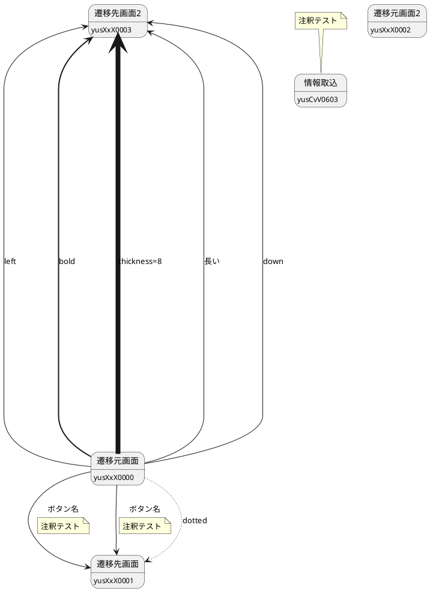

# 3012111130_03: 画面一覧→画面フローの生成（改訂版）

### 前提情報

---

### 手順

#### 1. インプット情報の整理

##### ① 画面一覧の準備

* 画面一覧をもとに下記一覧を作成する。
* 画面遷移図の**メイン画面**としたい画面に**「作成対象」**（〇）を付与する。


* 今回は**禀議・査定一覧**を対象とする。

##### ② ボタンごとの遷移先の整理

* 画面一覧を参考に**各画面のボタン→遷移先**をExcelで整理する。

  * 可能なら**全画面**を横串で確認して一括整理。
  * 難しければ**メイン画面の前後**（1段階）だけでも可。
  * 禀議についてはすでに全画面ある程度整理済み。


---

#### 2. インプット情報のマークダウン化

* **画面一覧**

  * Excelを**第1正規化**（結合セルなし／1セル1値）に整えてから、**Markdown表**にコピペ変換。
  * 空欄は **`-`** を入れる。

* **ボタンごとの遷移先の整理**

  * 可能なら**全画面**を1シートで横串整理。難しい場合は**メイン前後（1段階）**のみでも可。
  * フィルタ条件（いずれも**1段階のみ**）：

    * **ボタン一覧（メイン→他）**：`画面名` が **作成対象のメイン画面**（メイン→他）
    * **ボタン一覧（他→メイン）**：`遷移先（別画面の場合）` または `メイン画面への遷移` に **メイン画面名**（他→メイン）


##### 貼り付け位置ガイド（プロンプト内の見出し）

* **画面一覧（Markdown表）** → プロンプト内の `### 画面一覧（貼り付け）` の直下に**そのまま貼り付け**
* **ボタン一覧（メイン→他）** → プロンプト内の `### ボタン一覧（メイン→他）（貼り付け）` の直下に**そのまま貼り付け**
* **ボタン一覧（他→メイン）** → プロンプト内の `### ボタン一覧（他→メイン）（貼り付け）` の直下に**そのまま貼り付け**

##### インプット情報の注意点（利用者向け）

* **分割ルール**：`遷移先` に **「と」「,」「、」** が含まれる行は、**1遷移=1行**になるように**行を分割**してください。
* **同画面の除外**：`別／同画面` が **同画面** の行、**ヘルプ/閉じる/前後**などの操作は**貼り付けない**か、貼った後に**削除**してください。
* **名称の名寄せ**：画面名の**前後空白**・**全角/半角**・**括弧/中点/長音**の違いで一致判定が漏れることがあります。迷ったら**画面一覧の表記に合わせる**か、**例の通り**統一してください。
* **メイン判定**：`フロー作成時にメインにしたい画面フラグ` が **作成対象**の行がメインです。該当が複数あれば**図はメインごとに分割**されます。
* **検収のコツ**：

  * **行数チェック**：貼り付けた表の**対象行数**と、出力の`--> メインID`本数が**一致**しているか。
  * **モーダル表現**：`種類=モーダル` の行は**ボックス色#FF7F50**・**破線**になっているか。
  * **重複**：同じ `遷移元→遷移先:ボタン名` が**重複**していないか。

###### 良い例／悪い例（インプット整形）

**① 分割ルール**

* **悪い例（分割前）**

| 画面ID    | 画面名     | ボタン | 別／同画面 | 遷移先（別画面の場合）          |
| ------- | ------- | --- | ----- | -------------------- |
| RgV0201 | 禀議・査定一覧 | 開く  | 別画面   | 融資禀議書・査定書, 輸出禀議書・査定書 |

* **良い例（分割後）**

| 画面ID    | 画面名     | ボタン | 別／同画面 | 遷移先（別画面の場合） |
| ------- | ------- | --- | ----- | ----------- |
| RgV0201 | 禀議・査定一覧 | 開く  | 別画面   | 融資禀議書・査定書   |
| RgV0201 | 禀議・査定一覧 | 開く  | 別画面   | 輸出禀議書・査定書   |

**② 同画面の除外**

* **悪い例（貼るとNG）**：`別／同画面 = 同画面` の行
* **良い例**：貼らない（または貼った後に削除）

**③ 名称の名寄せ**

* **悪い例**：`禀議･査定一覧`（半角中点）と`禀議・査定一覧`（全角中点）を別物扱い
* **良い例**：一致判定時は同一とみなし、出力表示名は元の表記を維持

**④ 他→メイン検出と期待出力**

* 入力行：`画面ID=RgV050101` / `画面名=…直近計数照会` / `遷移先（別画面の場合）=禀議・査定一覧（メイン: RgV0201）` / `ボタン=過去禀査`
* **期待される出力（画面遷移の一行）**：`RgV050101 --> RgV0201 : 過去禀査`

**⑤ モーダル表現**

* **良い例（#FF7F50 + 破線）**

```plantuml
state RgV0402 as "権限指定" #FF7F50
RgV1001 -[dotted]-> RgV0402 : 権限指定
```

* **悪い例**：色指定なし／実線

---

#### 2.5 プロンプトの渡し方（最新ベストプラクティス）

* **命令は先頭に／データとはっきり分ける**：`## ROLE` や `## DATA` のように**見出しで区切る**。データは**コードフェンス（```）やタグ**で囲む。
* **出力仕様を厳密に**：PlantUMLのみをコードフェンスで。**余計な説明文は禁止**。
* **少数の良い/悪い例**を入れる：欲しい矢印（**他→メイン**）の**1行例**と、**除外例**（同画面/ヘルプ）を併記。
* **二度書き**で重要事項を固定：冒頭（OBJECTIVE）と末尾（PRE-FLIGHT）で**他→メイン必須**を**再掲**。
* **自己検査（チェックリスト）**を最後に：**対象行数＝矢印本数**、**モーダル#FF7F50+破線**、**重複なし**。
* **（設定可能な場合）温度は低め**：変換・抽出系は **0〜0.2** を推奨。

---

#### 3. 出来上がり内容の確認

* 実際に **[PlantUML](https://plantuml.rp.dss.itmufg/uml/SyfFKj2rKt3CoKnELR1Io4ZDoSa70000)** に貼り付け、**表示・体裁・漏れ**を確認し、必要に応じて修正する。

---

#### 4. 下記をコピーしてAI-bowに投稿してください

````プロンプト
## ROLE
- あなたはUIフロー設計のエキスパートであり、PlantUMLのダイアグラム生成に精通したプロフェッショナルです。

## OBJECTIVE（最優先ルール）
- 元表の **すべての行** を図に反映する。
- **他→メイン**（メイン画面が遷移先の行）は **必ず出力**：`{遷移元画面ID} --> {メイン画面の画面ID} : {ボタン名}`。
- メインの前後 **1段階のみ**（さらに先/手前は描かない）。
- **定義スコープ制限**：**定義するstateは「メイン自身」＋「メインに直接つながる画面（メイン→他／他→メイン）」のみ**。画面一覧に存在していても、**メインと1段階で紐づかない画面は定義しない**。
- 不明点は **「不足情報: 〜」** として **必要な列名** を明記して質問。回答が無い場合は **仮** と明示して進める。

## OUTPUT_SPEC（出力仕様・厳守）（出力仕様・厳守）
- **PlantUMLのみ**を ```plantuml フェンスで出力。**説明文や余計なテキストは出力しない**。
- セクション順：**ヘッダー → メイン機能定義 → 関連機能定義 → 画面遷移**。
- モーダル：**ボックス色 `#FF7F50`、遷移は破線**。
- 画面定義：**`state 画面ID as "画面名"` に統一**。表示名には **「・」や括弧** 等の記号を含めてよい（**二重引用符で囲む**）。箱内にIDを表示したい場合は**別行**で `画面ID : 画面ID` を追加。
- 矢印表記：**`{遷移元画面ID} --> {遷移先画面ID} : {ボタン名}`**（**メイン→他／他→メイン** いずれも **ID→ID** で記述）。

## SCOPE_RULES（メインに紐づかない画面を定義しない）
**関連判定ロジック（生成アルゴリズム）**
1. **メインID**＝画面一覧で「作成対象」の行の **画面ID**。
2. **OUT（メイン→他）**＝ボタン一覧（メイン→他）の対象行（`画面名=メイン名` かつ `別／同画面=別画面`）から **`遷移先（別画面の場合）` の画面ID集合**。
3. **IN（他→メイン）**＝ボタン一覧（他→メイン）の対象行（`遷移先（別画面の場合）=メイン名` または `メイン画面への遷移` にメイン名が含まれる）から **`画面ID（遷移元）` の集合**。
4. **定義対象ノード集合 S**＝ `{メインID} ∪ OUT ∪ IN`。
5. **state定義**は **S のみ**。**S に含まれない画面は、一切 state 定義しない**（同じメニュー区分にあっても除外）。
6. **edge（矢印）**は、
   - メイン→他：ボタン一覧（メイン→他）の**該当行**のみ `メインID --> 相手ID : ボタン` を出力。
   - 他→メイン：ボタン一覧（他→メイン）の**該当行**のみ `相手ID --> メインID : ボタン` を出力。

> **ポイント**：`画面一覧` は**属性の母集合**であり、**出力での定義対象は S に限定**する。

## GROUPING_RULES（グループ誤配置防止）
**配置アルゴリズム（厳守）**
1. 画面一覧から **`画面ID → メニュー区分・分割グループ`** の**辞書**を作る。
2. 集合 **S** 内の各画面IDについて、**必ず辞書の値のグループ**に state を配置する。
   - 例：`RgV0402（権限指定）` のメニュー区分が **付属部品**なら、**付属部品グループ**に定義する。**稟議グループに入れない**。
3. **モーダル**であっても、**呼び出し元のグループに引きずられない**。必ず **自分のメニュー区分**のグループに置く。
4. メニュー区分が欠落・不明な場合は、**「不足情報: 画面一覧の『メニュー区分・分割グループ』」** と質問してから進める（暫定で **未分類** に置く場合は **注記**を付ける）。

## NAME_NORMALIZATION（照合時のみ適用）（照合時のみ適用）
- **前後空白**・**全角/半角**・**括弧/中点/長音**の差分は無視して一致判定。出力表示名は **元表記** を保持。

## FEW_SHOT（良い例／悪い例）
### ✅ 良い例（他→メインを出力）
- 入力該当：`画面名=融資禀議書・査定書（計数情報） 直近計数照会（RgV050101）` ／ `遷移先=禀議・査定一覧（メイン, RgV0201）` ／ `ボタン=過去禀査`
- 期待出力（一行）：`RgV050101 --> RgV0201 : 過去禀査`

### ✅ 良い例（モーダルの表現とグループ配置）
```plantuml
state 付属部品グループ {
  state RgV0402 as "権限指定" #FF7F50
  RgV0402 : RgV0402
}
RgV1001 -[dotted]-> RgV0402 : 権限指定
````

※ **モーダルは自分のメニュー区分のグループ**（付属部品）に置く。呼び出し元（稟議）に入れない。

### ❌ 悪い例（メニュー区分の誤配置）

```plantuml
state 稟議グループ {
  state RgV0402 as "権限指定" #FF7F50  ' 本来は付属部品
}
```

### ❌ 悪い例（メインと紐づかない画面を定義してしまう）

**入力**：画面一覧に `RgV1901 格付禀議書・査定書` があるが、ボタン一覧（メイン→他／他→メイン）に **該当行なし**。
**NG出力**（定義してしまっている）：

```plantuml
state RgV1901 as "格付禀議書・査定書"
```

**OK**：この state は **出力しない**（S に含まれないため）。

### ❌ 悪い例（表示名で参照してしまう）

```plantuml
"融資禀議書・査定書（計数情報） 直近計数照会" --> RgV0201 : 過去禀査
```

※ 遷移は **ID→ID** で記述すること。

### ❌ 悪い例（同画面の行を出力）

`別／同画面=同画面` の行（前/後/閉じる/ヘルプ等）を遷移として出力してしまう。

## 入力フォーマット（読み方と利用ルール）（読み方と利用ルール）

### メイン画面の特定

* **画面一覧**の「フロー作成時にメインにしたい画面フラグ」が **「作成対象」** の行がメイン画面。

### 画面一覧（Markdown表）

1. **フロー作成時にメインにしたい画面フラグ**：メインごとに **個別のダイアグラム** を作成。前後 **1段階のみ**。
2. **画面ID**：**`state 画面ID as "画面名"` に統一**。箱内にIDも表示したい場合は **別行**で `画面ID : 画面ID` を追加。
3. **メニュー区分・分割グループ**：この単位で **state グループ** を作成。**必ずこの列の値でグルーピングする（接続関係・呼び出し元で決めない）**。
4. **和名**：利用不能文字は **alias** で表示。

### ボタン一覧（メイン画面からの遷移先情報）

5. **種類（親、子、モーダル）**：モーダルは **#FF7F50**・**破線**。
6. **遷移先**：`と` や `,` を含む場合は **分割**して別行に。

### ボタン一覧（メイン画面への遷移情報）

7. **画面名**（遷移元）
8. **種類（親、子、モーダル）**
9. **メイン画面への遷移 / 遷移先（別画面の場合）**：

   * この列に **メイン画面名** がある行は **必ず** 「他→メイン」を追加。
   * 矢印は **遷移元=当該行の画面ID**, **遷移先=メインの画面ID**。ボタン名未記載は **"遷移"**。

## DATA（ここにあなたのMarkdown表を貼り付け）

### 画面一覧（貼り付け）

[ここに **画面一覧のMarkdown表** を貼り付けてください]

### ボタン一覧（メイン→他）（貼り付け）

[ここに **ボタン一覧（メイン→他）** のMarkdown表を貼り付けてください]

### ボタン一覧（他→メイン）（貼り付け）

[ここに **ボタン一覧（他→メイン）** のMarkdown表を貼り付けてください]

---（以下は**例**。実データを貼る場合は**削除**可）---

### 画面一覧（例）

| フロー作成時にメインにしたい画面フラグ | メニュー区分・分割グループ | 画面ID    | 和名（確定）2025/10/03確定 | 物理名（検討中）桁数上限見直し済・MUIT最終確認済開発推進申請中 |
| ------------------- | ------------- | ------- | ------------------ | --------------------------------- |
| -                   | ホーム           | RgV0101 | 禀議ホーム              | RingiHome                         |
| **作成対象**            | 一覧            | RgV0201 | 禀議・査定一覧            | RinsaLst                          |
| ...（中略）...          |               |         |                    |                                   |

### ボタン一覧（メイン→他：例）

| メニュー区分 | 画面ID | 物理名 | 画面名 | 部品 | 種類（親、子、モーダル） | ボタン | ボタン種類 | 別／同画面 | 遷移先（別画面の場合） |
| 一覧 | RgV0201 | RinsaLst | 禀議・査定一覧 | 禀議・査定一覧 | 親 | 開く | その他ボタン群（右上） | 別画面 | 融資禀議書・査定書 |

### ボタン一覧（他→メイン：例）

| メニュー区分 | 画面ID | 物理名 | 画面名 | 部品 | 種類（親、子、モーダル） | ボタン | ボタン種類 | 別／同画面 | 遷移先（別画面の場合） |
| 稟議 | RgV050101 | YushiRinsashoLastCnt | 融資禀議書・査定書（計数情報）　直近計数照会 | 融資禀議書・査定書（計数情報） 直近計数照会 | 親 | 過去禀査 | その他ボタン群（右上） | 別画面 | 禀議・査定一覧 |

## PRE-FLIGHT（自己検査)

* [ ] メインごとに**前後1段階**のみ（メイン→他／他→メイン）
* [ ] **定義対象ノード集合 S**＝ `{メインID} ∪ OUT ∪ IN` の**み**が state 定義されている（**S 外の画面が定義されていない**）
* [ ] **グループ不一致=0**（各 state の配置グループが **画面一覧の「メニュー区分・分割グループ」** と一致）
* [ ] **他→メイン**が**ゼロ落ち**していない（対象行数＝矢印本数）
* [ ] モーダルは **#FF7F50 + 破線**（ただし **グループは自分のメニュー区分**）
* [ ] **すべての遷移参照がID（=画面ID）**になっている（表示名参照なし）
* [ ] **識別子に禁止文字**（「・」や括弧、空白など）が**含まれていない**
* [ ] **孤立stateが0**（メインと直結しないノードが定義されていない）
* [ ] 重複遷移がない
* [ ] 不明点は **不足情報** として列名を明示して質問
* [ ] メインごとに**前後1段階**のみ
* [ ] **他→メイン**が**ゼロ落ち**していない（対象行数＝矢印本数）
* [ ] モーダルは **#FF7F50 + 破線**
* [ ] **すべての遷移参照がID（=画面ID）**になっている（表示名参照なし）
* [ ] **識別子に禁止文字**（「・」や括弧、空白など）が**含まれていない**
* [ ] 重複遷移がない
* [ ] 不明点は **不足情報** として列名を明示して質問

```plantuml
@startuml

' ヘッダー
---
id: RgV0201
title: 禀議・査定一覧 画面遷移図
sidebar_label: 禀議・査定一覧
sidebar_position: 1
---

left to right direction
hide empty description

' メイン機能定義（例）
state 一覧グループ {
    state RgV0201 as "禀議・査定一覧"
    RgV0201 : RgV0201
    state RgV0202 as "禀議・査定期限管理一覧"
    RgV0202 : RgV0202
}

' 関連機能定義（例）
state 作成グループ {
    state RgV0301 as "基本情報入力"
    RgV0301 : RgV0301
    state RgV0302 as "利率変更禀議書・査定書 対象期間選択"
    RgV0302 : RgV0302
}
state 稟議グループ {
    state RgV1001 as "融資禀議書・査定書"
    RgV1001 : RgV1001
}
state 付属部品グループ {
    state RgV0409 as "インサイダー情報" #FF7F50
    RgV0409 : RgV0409
    state RgV0402 as "権限指定" #FF7F50
    RgV0402 : RgV0402
}

' 画面遷移（ID→ID 表記）
RgV0201 --> RgV1001 : 開く
RgV0301 --> RgV1001 : 作成
RgV0302 --> RgV1001 : 決定

' 他→メイン（取りこぼし防止の重要例）
RgV0501   --> RgV0201 : 過去禀査
RgV050101 --> RgV0201 : 過去禀査
RgV0502   --> RgV0201 : 過去禀査
RgV050201 --> RgV0201 : 過去禀査

' モーダル遷移（破線）
RgV1001 -[dotted]-> RgV0409 : インサイダー情報
RgV1001 -[dotted]-> RgV0402 : 権限指定

@enduml
```

---

## デザイン例



---

### 用語・表記の統一（揺らぎ対策）

* **AI-bow**（"Ai-bow" 表記は使わない）
* **禀議・査定**／**禀査**：表記は原則 **「禀議・査定」** に統一（データ列の原文は尊重）。
* **コピペ**（"ピーして"等の表現は使わない）
* **メニュー区分・分割グループ**：`state` グループ名の源泉として使用。
* 文言の丁寧表現：「下しさい」→「ください」 等を修正済み。
