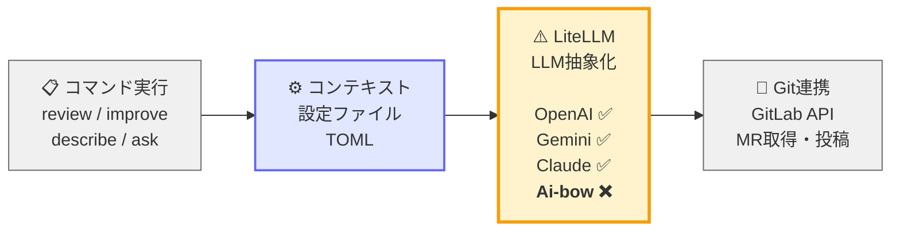
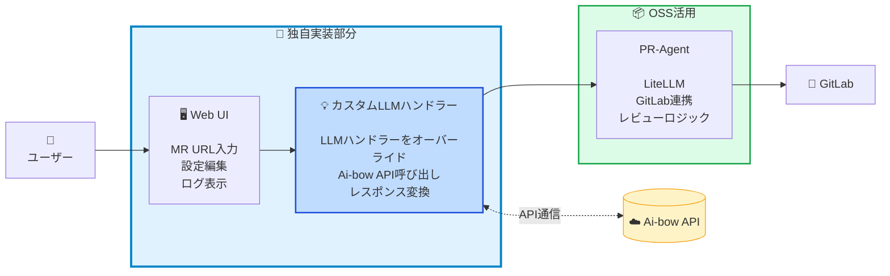
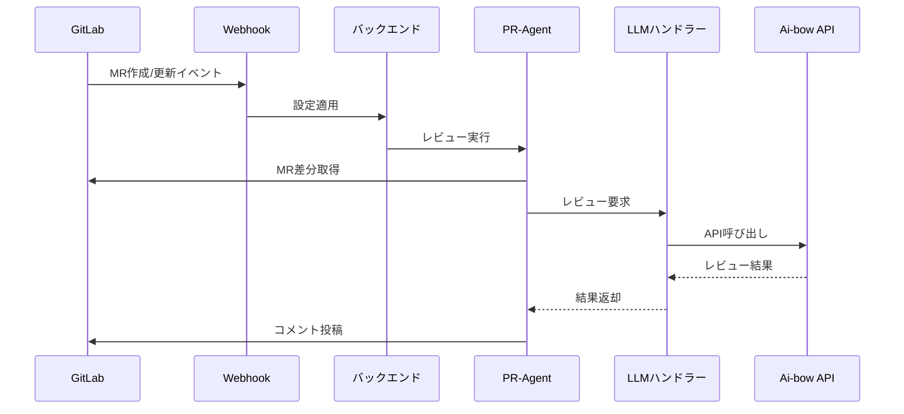

# PR-Agent

> **目的**:
> GitLab のマージリクエスト（MR）を自動レビューし、レビュアーの負担を軽減しつつ品質を標準化する

---

## 🧭 要約

### 何をしたか

PR-Agent（OSS）をカスタムして **MR のレビューアプリ**を構築：

1. **カスタム LLM ハンドラー** - Ai-bow API 対応
2. **ツール実行の Web UI（Streamlit）** - 検証フェーズで使う用
3. **設定ファイルの管理** - ドメイン別レビュー基準

### 今後何をしたいか

1. **設定ファイルのブラッシュアップ** - Java、Salesforce、DTO 等のレビュー観点を精緻化
1. **Webhook 自動実行への移行** - 全 MR を自動レビュー

---

## 📖 内容

### PR-Agent とは？

[PR-Agent](https://github.com/Codium-ai/pr-agent) は **コードレビューを自動化する OSS**。

**できること（主要コマンド）**

- 📝 **`/review`** - コードレビュー実行

  - セキュリティ、パフォーマンス、テスト、設計などの観点で自動レビュー
  - 問題点・改善提案を MR にコメント投稿

- 💡 **`/improve`** - コード改善提案

  - より良い実装方法の提案
  - バグや匂いの指摘

- 📄 **`/describe`** - MR 説明文の自動生成

  - 変更内容の要約
  - 変更理由・影響範囲の説明

- ❓ **`/ask`** - コードに関する質問回答
  - 特定の変更についての質問に回答

**通常の利用形態**

- Webhook 連携で MR 作成/更新時に自動実行
- CLI から手動実行

**設定ファイル（TOML）でカスタマイズ**

- PR-Agent は TOML ファイルでカスタムプロンプトを指定可能。
- プロジェクト特化のレビュー観点を追加できる。
  ```toml
  [pr_reviewer]
  extra_instructions = """
  - Javaのコーディング規約
  - Salesforce のコーディング規約
  - DTO パターン確認
  """
  ```

**PR-Agent（OSS）の内部構成**

PR-Agent は **Python ベース**のツールで、以下の構成：



---

## 🎯 独自実装とカスタマイズ

### 3 つの課題

**❶ Ai-bow API が使えない**

LiteLLM は外部 LLM サービス（OpenAI、Gemini、Claude）に対応しているが、
社内の **Ai-bow API には非対応**。

**❷ いきなり Webhook 運用はハードル高い**

いきなり Hook での運用にすると検証できず、手戻りの可能性あり。

**❸ ドメイン特化のレビュー基準が必要**

Java、Salesforce、DTO など、プロジェクトごとに異なるレビュー観点を検証しながら調整する必要あり。

### 解決策：3 層の独自実装

上記の課題に対応するため、以下を実装：

| 課題           | 実装内容                                                                                |
| -------------- | --------------------------------------------------------------------------------------- |
| **❶ LLM 対応** | カスタム LLM ハンドラー<br/>→ LLM ハンドラーをオーバーライドして Ai-bow API に対応      |
| **❷ 検証環境** | Streamlit Web UI<br/>→ 手動実行・ログ確認で安全に検証                                   |
| **❸ 設定管理** | TOML 設定ファイル管理<br/>→ Web UI から選択・編集し、レビュー基準を検証しながら調整可能 |

---

## 💻 準備したもの

上記の独自実装を組み込んで、以下のシステムを構築：



**ポイント：**

- カスタム LLM ハンドラーが Ai-bow API と PR-Agent の橋渡し役
- ユーザーは Web UI から手動で検証可能

### 実際の画面

**① PR-Agent 実行画面**


**② 実行ログ・結果表示**


**③ 設定ファイル編集画面**


---

## 🔄 Webhook 自動実行フロー（将来像）



---

## 💡 MCP での都度コメントへの優位性

今回の目的は「MR レビューの自動化・標準化」。MCP は以下の理由で適さない：

1. **対話型のため自動化できない**

   - MCP: ユーザーが毎回指示を出す必要あり
   - 目標: Webhook で全 MR を自動レビュー

2. **個人の開発環境に閉じる**

   - MCP: 各開発者のローカル環境で動作
   - 目標: チーム全体で統一基準のレビュー

3. **タイミングが異なる**
   - MCP: コード作成中（Before）
   - 目標: MR 作成後のレビュー（After）

### 比較表

| 観点               | MCP                      | PR-Agent（このツール）     |
| ------------------ | ------------------------ | -------------------------- |
| **目的**           | コード作成支援           | レビュー自動化             |
| **実行タイミング** | 開発中（コーディング時） | MR 作成後                  |
| **自動化**         | ❌ 対話型（手動）        | ✅ Webhook で完全自動      |
| **適用範囲**       | 個人のローカル環境       | チーム全体の MR            |
| **レビュー標準化** | 個人の判断に依存         | 統一基準で全 MR をチェック |

---

## 🔗 参考リンク

- [PR-Agent GitHub](https://github.com/Codium-ai/pr-agent)
- [PR-Agent Docs](https://pr-agent-docs.codium.ai/)

---

## 📎 付録 A: GitLab Webhook（例）

- Event: `Merge Request events`
- Secret Token: プロジェクト固有の値を設定（受信側で検証）
- URL: Webhook エンドポイント（Phase2 以降で有効化）

---

## 🧩 今後の拡張

- MR サイズに応じた **段階的プロンプト**（大差分 → 要約 → 詳細ピンポイント）
- **週次レビュー洞察レポート**（ホットスポット、傾向、改善提案）
- **プロジェクト別プロファイル**（言語/フレームワーク/ルール範囲の自動切替）

---
