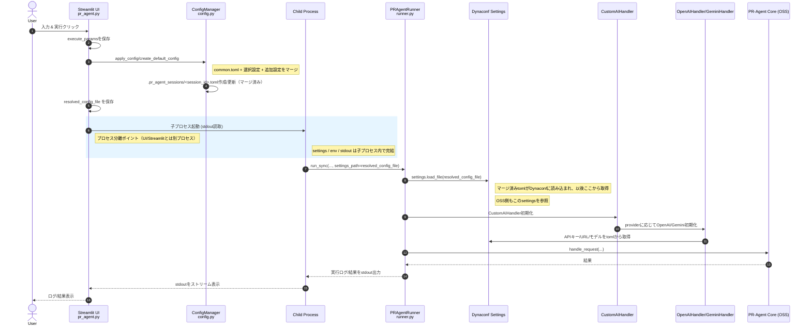

```mermaid
sequenceDiagram
    autonumber
    actor U as User
    participant UI as Streamlit UI<br/>pr_agent.py
    participant CM as ConfigManager<br/>config.py
    participant SP as Child Process
    participant RUN as PRAgentRunner<br/>runner.py
    participant ST as Dynaconf Settings
    participant H as CustomAIHandler
    participant OAI as OpenAIHandler/GeminiHandler
    participant AG as PR-Agent Core (OSS)

    U->>UI: 入力 & 実行クリック
    UI->>UI: execute_paramsを保存
    UI->>CM: apply_config/create_default_config
    Note right of CM: common.toml + 選択設定 + 追加設定をマージ
    CM->>CM: .pr_agent_sessions/<session_id>.toml作成/更新（マージ済み）
    UI->>UI: resolved_config_file を保存
    rect rgb(230, 245, 255)
        UI->>SP: 子プロセス起動 (stdout読取)
        Note right of UI: プロセス分離ポイント（UI/Streamlitとは別プロセス）
        Note right of SP: settings / env / stdout は子プロセス内で完結
    end
    SP->>RUN: run_sync(..., settings_path=resolved_config_file)
    RUN->>ST: settings.load_file(resolved_config_file)
    Note right of ST: マージ済みtomlがDynaconfに読み込まれ、以後ここから取得
    Note right of ST: OSS側もこのsettingsを参照
    RUN->>H: CustomAIHandler初期化
    H->>OAI: providerに応じてOpenAI/Gemini初期化
    OAI->>ST: APIキー/URL/モデルをtomlから取得
    RUN->>AG: handle_request(...)
    AG-->>RUN: 結果
    RUN-->>SP: 実行ログ/結果をstdout出力
    SP-->>UI: stdoutをストリーム表示
    UI-->>U: ログ/結果表示
```
