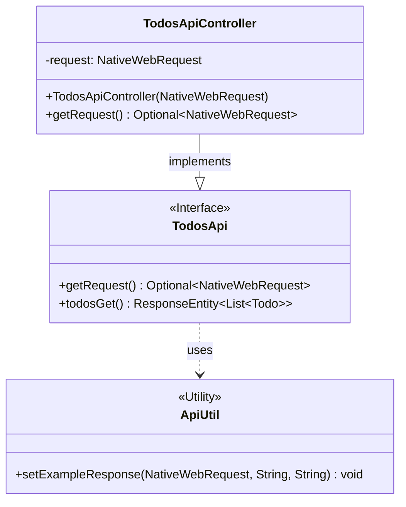

# OpenAPI 生成サーバー

Spring Boot サーバー

## 概要

このサーバーは [OpenAPI Generator](https://openapi-generator.tech) プロジェクトによって生成されました。
[OpenAPI-Spec](https://openapis.org) を使用することで、サーバーのスタブを簡単に生成できます。
これは、SpringBoot フレームワークを使用して OpenAPI 対応サーバーを Java で構築する例です。

OpenAPI を Spring Boot に統合する基盤となるライブラリは [springdoc](https://springdoc.org) です。
Springdoc は、生成されたコントローラークラスとモデルクラスに基づいて OpenAPI v3 仕様を生成します。
仕様は次の URL を使用してダウンロードできます:
http://localhost:8080/v3/api-docs/

サーバーを単純な Java アプリケーションとして起動します。

次の URL にアクセスすることで、swagger-ui で API ドキュメントを表示できます:
http://localhost:8080/swagger-ui.html

デフォルトのポート値を `application.properties` で変更してください。

## クラス図

以下の図は、`org.openapitools.api` パッケージ内の主要なクラス間の関係を示しています。

### 関係性の説明

- **`TodosApi` (インターフェース):** Todos API の契約を定義します。エンドポイント（例: `GET /todos`）を記述するために OpenAPI アノテーションを使用します。`ApiUtil` を使用してサンプルレスポンスを提供する `todosGet` メソッドのデフォルト実装を持っています。
- **`TodosApiController` (コントローラー):** このクラスは `TodosApi` インターフェースを実装します。実際の HTTP リクエストを処理する Spring の `@Controller` です。コンストラクタを介して `NativeWebRequest` がインジェクトされます。
- **`ApiUtil` (ユーティリティ):** `TodosApi` インターフェースのデフォルトメソッドで使用されるヘルパークラスで、サンプルレスポンスを生成および設定します。これは、完全な実装を記述することなく、モックサーバーを迅速にセットアップするのに役立ちます。
