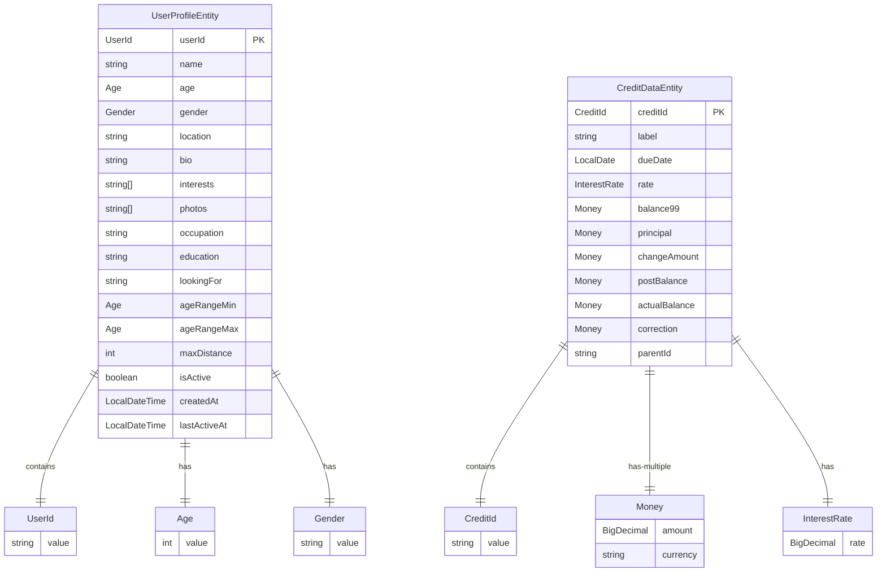
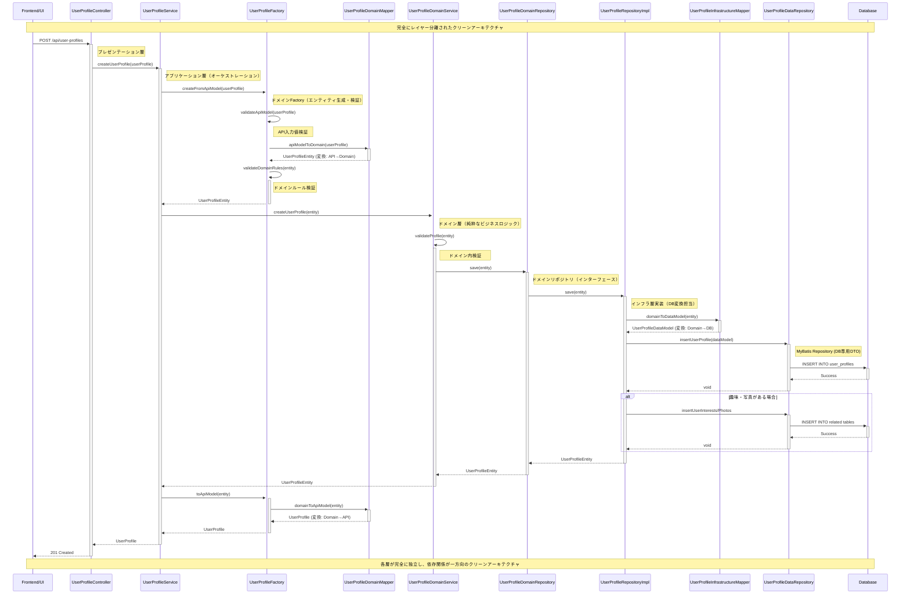

# OpenAPI 生成サーバー

Spring Boot サーバー

## 概要

このサーバーは [OpenAPI Generator](https://openapi-generator.tech) プロジェクトによって生成されました。
[OpenAPI-Spec](https://openapis.org) を使用することで、サーバーのスタブを簡単に生成できます。
これは、SpringBoot フレームワークを使用して OpenAPI 対応サーバーを Java で構築する例です。

OpenAPI を Spring Boot に統合する基盤となるライブラリは [springdoc](https://springdoc.org) です。
Springdoc は、生成されたコントローラークラスとモデルクラスに基づいて OpenAPI v3 仕様を生成します。
仕様は次の URL を使用してダウンロードできます:
http://localhost:8080/v3/api-docs/

サーバーを単純な Java アプリケーションとして起動します。

次の URL にアクセスすることで、swagger-ui で API ドキュメントを表示できます:
http://localhost:8080/swagger-ui.html

デフォルトのポート値を `application.properties` で変更してください。

## ER図

以下の図は、`org.openapitools.domain` パッケージ内の主要なエンティティクラス間の関係を示しています。


```mermaid
erDiagram
    UserProfileEntity {
        UserId userId PK
        string name
        Age age
        Gender gender
        string location
        string bio
        string[] interests
        string[] photos
        string occupation
        string education
        string lookingFor
        Age ageRangeMin
        Age ageRangeMax
        int maxDistance
        boolean isActive
        LocalDateTime createdAt
        LocalDateTime lastActiveAt
    }
    
    CreditDataEntity {
        CreditId creditId PK
        string label
        LocalDate dueDate
        InterestRate rate
        Money balance99
        Money principal
        Money changeAmount
        Money postBalance
        Money actualBalance
        Money correction
        string parentId
    }
    
    UserId {
        string value
    }
    
    CreditId {
        string value
    }
    
    Age {
        int value
    }
    
    Gender {
        string value
    }
    
    Money {
        BigDecimal amount
        string currency
    }
    
    InterestRate {
        BigDecimal rate
    }
    
    UserProfileEntity ||--|| UserId : contains
    CreditDataEntity ||--|| CreditId : contains
    UserProfileEntity ||--|| Age : has
    UserProfileEntity ||--|| Gender : has
    CreditDataEntity ||--|| Money : has-multiple
    CreditDataEntity ||--|| InterestRate : has
```

### エンティティの説明

- **`UserProfileEntity`:** ユーザープロフィール情報を管理するドメインエンティティ。ユーザーの基本情報、設定、アクティビティ履歴を含みます。
- **`CreditDataEntity`:** 信用データを管理するドメインエンティティ。残高、金利、期日などの金融情報を含みます。
- **値オブジェクト:** `UserId`、`CreditId`、`Age`、`Gender`、`Money`、`InterestRate` などの値オブジェクトが、エンティティの一部として使用されています。

## リクエストフロー図


```mermaid
sequenceDiagram
    participant UI as Frontend/UI
    participant Controller as UserProfileController
    participant AppService as UserProfileService
    participant Factory as UserProfileFactory
    participant APIMapper as UserProfileDomainMapper
    participant DomainService as UserProfileDomainService
    participant DomainRepo as UserProfileDomainRepository
    participant InfraRepo as UserProfileRepositoryImpl
    participant InfraMapper as UserProfileInfrastructureMapper
    participant DataRepo as UserProfileDataRepository
    participant DB as Database

    Note over UI, DB: 完全にレイヤー分離されたクリーンアーキテクチャ

    UI->>+Controller: POST /api/user-profiles
    Note right of Controller: プレゼンテーション層
    
    Controller->>+AppService: createUserProfile(userProfile)
    Note right of AppService: アプリケーション層（オーケストレーション）
    
    AppService->>+Factory: createFromApiModel(userProfile)
    Note right of Factory: ドメインFactory（エンティティ生成・検証）
    
    Factory->>+Factory: validateApiModel(userProfile)
    Note right of Factory: API入力値検証
    
    Factory->>+APIMapper: apiModelToDomain(userProfile)
    APIMapper-->>-Factory: UserProfileEntity (変換: API→Domain)
    
    Factory->>+Factory: validateDomainRules(entity)
    Note right of Factory: ドメインルール検証
    
    Factory-->>-AppService: UserProfileEntity
    
    AppService->>+DomainService: createUserProfile(entity)
    Note right of DomainService: ドメイン層（純粋なビジネスロジック）
    
    DomainService->>+DomainService: validateProfile(entity)
    Note right of DomainService: ドメイン内検証
    
    DomainService->>+DomainRepo: save(entity)
    Note right of DomainRepo: ドメインリポジトリ（インターフェース）
    
    DomainRepo->>+InfraRepo: save(entity)
    Note right of InfraRepo: インフラ層実装（DB変換担当）
    
    InfraRepo->>+InfraMapper: domainToDataModel(entity)
    InfraMapper-->>-InfraRepo: UserProfileDataModel (変換: Domain→DB)
    
    InfraRepo->>+DataRepo: insertUserProfile(dataModel)
    Note right of DataRepo: MyBatis Repository (DB専用DTO)
    DataRepo->>+DB: INSERT INTO user_profiles
    DB-->>-DataRepo: Success
    DataRepo-->>-InfraRepo: void
    
    alt 趣味・写真がある場合
        InfraRepo->>+DataRepo: insertUserInterests/Photos
        DataRepo->>+DB: INSERT INTO related tables
        DB-->>-DataRepo: Success
        DataRepo-->>-InfraRepo: void
    end
    
    InfraRepo-->>-DomainRepo: UserProfileEntity
    DomainRepo-->>-DomainService: UserProfileEntity
    DomainService-->>-AppService: UserProfileEntity
    
    AppService->>+Factory: toApiModel(entity)
    Factory->>+APIMapper: domainToApiModel(entity)
    APIMapper-->>-Factory: UserProfile (変換: Domain→API)
    Factory-->>-AppService: UserProfile
    
    AppService-->>-Controller: UserProfile
    Controller-->>-UI: 201 Created

    Note over UI, DB: 各層が完全に独立し、依存関係が一方向のクリーンアーキテクチャ
```

## アーキテクチャの特徴

### **1. レイヤー分離**
- **プレゼンテーション層**: REST API、コントローラー
- **アプリケーション層**: ユースケース、オーケストレーション
- **ドメイン層**: ビジネスロジック、エンティティ、値オブジェクト
- **インフラストラクチャ層**: データアクセス、外部サービス

### **2. 依存関係の制御**
```
UI → Application → Domain
             ↓
        Infrastructure → DB
```

### **3. データ変換の責任分離**
- **UserProfileDomainMapper**: API ↔ Domain変換
- **UserProfileInfrastructureMapper**: Domain ↔ DB変換
- **UserProfileFactory**: ドメインエンティティ生成・検証

### **4. Lombokによるコードの簡略化**
```java
@Data                    // getter/setter/toString/equals/hashCode
@NoArgsConstructor      // デフォルトコンストラクタ
@AllArgsConstructor     // 全フィールドコンストラクタ
@Getter                 // getterのみ
@EqualsAndHashCode      // equals/hashCode
@ToString(of = "value") // 指定フィールドのtoString
```

## パッケージ構造

### **理想的なクリーンアーキテクチャ構造**
```
org.openapitools
├── presentation          # プレゼンテーション層
│   ├── api              # REST Controllers
│   │   ├── UserProfileController
│   │   └── CreditDataController
│   └── dto              # API Request/Response DTOs
│       └── UserProfileDto
│
├── application          # アプリケーション層
│   └── service          # Application Services (ユースケース)
│       ├── UserProfileService
│       └── CreditDataService
│
├── domain               # ドメイン層
│   ├── entity           # ドメインエンティティ
│   │   ├── UserProfileEntity
│   │   └── CreditDataEntity
│   ├── valueobject      # 値オブジェクト
│   │   ├── UserId, Age, Gender
│   │   ├── CreditId, Money, InterestRate
│   ├── repository       # リポジトリインターフェース
│   │   ├── UserProfileDomainRepository
│   │   └── CreditDataDomainRepository
│   ├── service          # ドメインサービス
│   │   ├── UserProfileDomainService
│   │   └── CreditDataDomainService
│   └── factory          # ファクトリ
│       ├── UserProfileFactory
│       └── CreditDataFactory
│
└── infrastructure       # インフラストラクチャ層
    ├── repository       # リポジトリ実装
    │   ├── UserProfileRepositoryImpl
    │   ├── UserProfileDataRepository (MyBatis)
    │   └── CreditDataRepositoryImpl
    ├── dto              # データベース専用DTO
    │   ├── UserProfileDataModel
    │   └── CreditDataModel
    └── mapper           # インフラ専用マッパー
        ├── UserProfileInfrastructureMapper
        └── CreditDataInfrastructureMapper
```

### **パッケージ移行実施状況**

**✅ 完了した構造**

**ドメイン層**
- `domain.entity.*` - ドメインエンティティ
- `domain.valueobject.*` - 値オブジェクト  
- `domain.service.*` - ドメインサービス
- `domain.repository.*` - リポジトリインターフェース
- `domain.factory.*` - ファクトリ

**インフラストラクチャ層**
- `infrastructure.repository.*` - リポジトリ実装
- `infrastructure.dto.*` - DB専用DTO
- `infrastructure.mapper.*` - インフラマッパー

**プレゼンテーション層**（✅ 移行完了）
- `presentation.api.*` - RESTコントローラー
- `presentation.dto.*` - API DTO

**アプリケーション層**（✅ 移行完了）
- `application.service.*` - アプリケーションサービス
- `application.mapper.*` - ドメインマッパー（API↔Domain変換）

### **整理完了状況**
- ✅ 不要なimport文を削除
- ✅ 古いパッケージディレクトリを削除
- ✅ 重複ファイルを削除
- 🔄 OpenAPI生成モデル（`model.*`）は既存構造のまま維持

### **クリーンアーキテクチャの実現**
パッケージ構造により、依存関係の方向性が明確化：
```
presentation → application → domain
                         ↑
                  infrastructure
```
