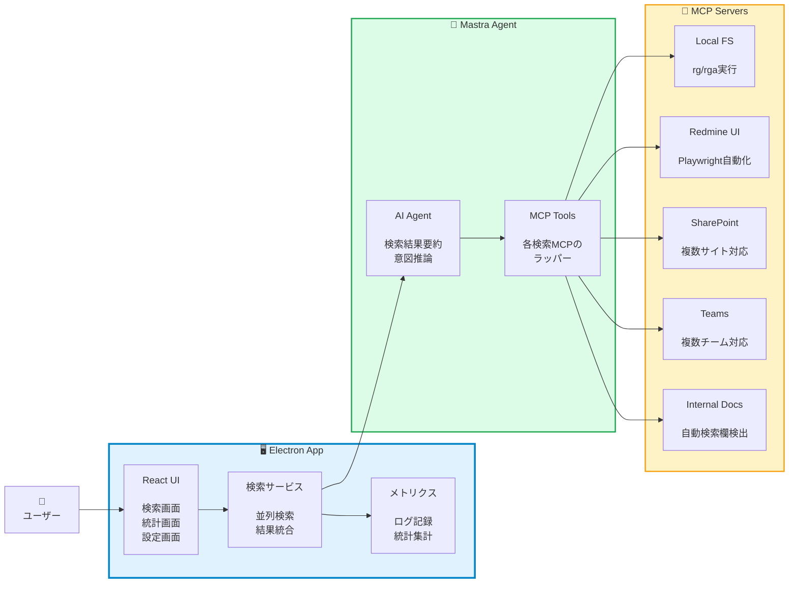
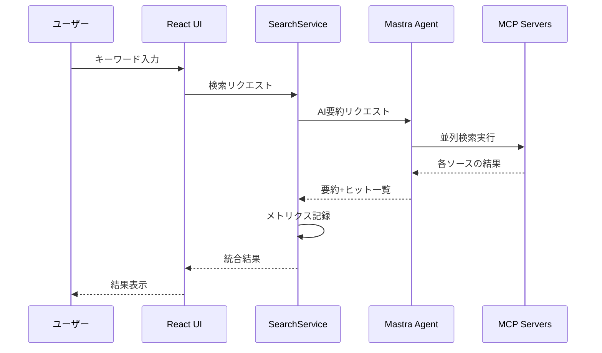
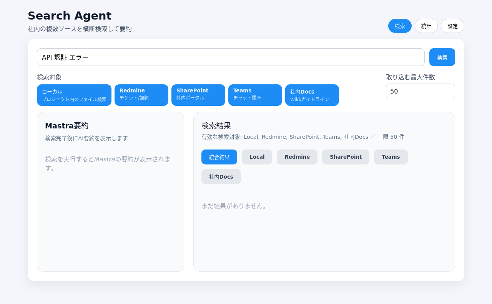
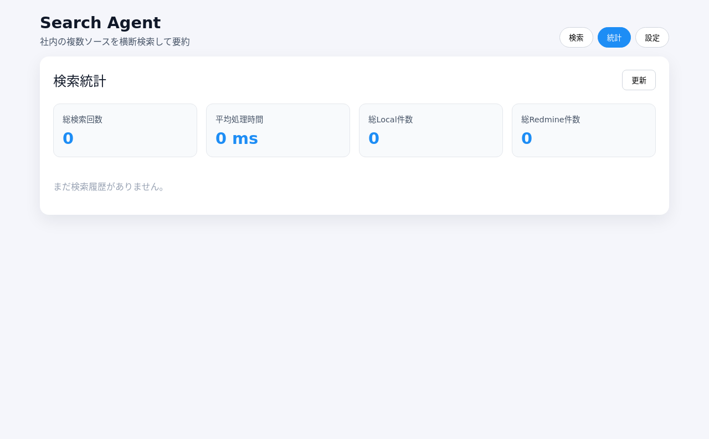

# SearchTool - 統合検索エージェント

> **⚠️ 開発状況** > **コア機能は 95% 完成**。ビルドは成功し、Linux AppImage (156MB) が生成されています。
> 実際の動作には外部依存関係（ripgrep, Playwright ブラウザ）のインストールと環境変数の設定が必要です。
> 詳細は [STATUS.md](./STATUS.md) を参照してください。
>
> **目的**:
> ローカルファイル、Redmine、SharePoint、Teams、社内ドキュメントを一括検索し、AI が検索結果を要約することで情報収集の効率を大幅に向上させる

---

> 📚 ドキュメント一式は `docs/README.md`（Documentation Hub）に集約しました。まずそこを開けば主要な説明とリンクが揃っています。

## 🧭 要約

### 何をしたか

MCP（Model Context Protocol）と Mastra を活用した **統合検索デスクトップアプリ**を構築：

1. **マルチソース検索** - ローカル/Redmine/SharePoint/Teams/社内ドキュメントを並列検索
2. **AI 要約機能** - Mastra エージェントが検索結果を自動要約
3. **Electron デスクトップアプリ** - クロスプラットフォーム対応（Windows/Linux）

### 何ができるか

1. **高速なローカルファイル検索** - ripgrep（rg/rga）による高速全文検索
2. **複数サービスの統合検索** - Redmine、SharePoint、Teams、社内ドキュメントを一括検索
3. **検索結果の AI 要約** - 膨大な検索結果から重要な情報を自動抽出
4. **検索履歴とメトリクス** - 検索統計、処理時間、ヒット数の追跡

---

## 📖 内容

### SearchTool とは？

**SearchTool** は、複数の情報源を横断的に検索し、AI が結果を要約してくれるデスクトップアプリケーションです。

**主な機能**

- 🔍 **統合検索** - 複数のソースを同時検索

  - ローカルファイル（ripgrep ベース）
  - Redmine チケット
  - SharePoint ドキュメント（複数サイト対応）
  - Teams メッセージ（複数チーム対応）
  - 社内ドキュメントサイト

- 🤖 **AI 要約** - Mastra エージェントが検索結果を分析

  - 検索結果の自動要約
  - 重要度順のソート
  - 検索意図の推論

- 📊 **メトリクス & ログ** - 検索パフォーマンスの可視化

  - 総検索回数
  - 平均処理時間
  - ソース別ヒット数
  - 検索履歴（最新 10 件）

- ⚙️ **柔軟な設定** - ソースごとのカスタマイズ
  - 検索対象ディレクトリ
  - 除外パターン（.git、node_modules など）
  - タイムアウト、最大件数の制御

### 技術スタック

**フロントエンド**

- Electron 30
- React 18 + TypeScript
- Vite（高速ビルド）

**バックエンド**

- Mastra（AI エージェントフレームワーク）
- MCP（Model Context Protocol）サーバー
- Playwright（ブラウザ自動化）
- Zod（スキーマ検証）

**検索エンジン**

- ripgrep（rg）- 高速テキスト検索
- ripgrep-all（rga）- PDF/Office ファイル対応

---

## 🎯 アーキテクチャ

### システム構成



**ポイント：**

- MCP サーバーが各検索ソースを抽象化
- Mastra エージェントが検索結果を AI で要約
- 並列検索（Promise.allSettled）で高速化

### データフロー



---

## 💻 使い方

### 前提条件

**必須:**

- Node.js 18 以上
- ripgrep (`rg`) - ローカルファイル検索用

**AI 要約機能を使う場合（オプション）:**

- OpenAI API キー
  - 🆕 **設定画面から登録可能**（環境変数不要）
  - または環境変数 `OPENAI_API_KEY` で設定

**オプション:**

- ripgrep-all (`rga`) - PDF/Office ファイル検索用
- Playwright Chromium - Web 検索用

### インストール

```bash
cd /home/ec2-user/salesforce/searchtool/app

# 1. npm 依存関係のインストール
npm install

# 2. Playwright ブラウザのインストール（Web 検索を使う場合）
npx playwright install chromium

# 3. ripgrep のインストール（システムによって異なる）
# Ubuntu/Debian:
sudo apt install ripgrep

# macOS:
brew install ripgrep

# 4. 環境変数の設定（オプション - 設定画面からも登録可能）
# AI要約機能を使う場合のみ必要
cat > ../.env <<EOF
OPENAI_API_KEY=sk-your-api-key-here
MASTRA_MODEL_ID=openai/gpt-4o-mini
EOF

# または、アプリ起動後に設定画面から登録することも可能です（推奨）
```

### 開発モード

```bash
npm run dev
```

### ビルド

```bash
# Linux版ビルド
npm run build:linux

# Windows版ビルド
npm run build:win

# 両方ビルド
npm run build:all
```

### 初回セットアップ

1. **アプリを起動**し、「設定」タブを開く

2. **🆕 AI 設定**（AI 要約機能を使う場合）

   - OpenAI API キー: `sk-proj-...`（[API キー取得方法](https://platform.openai.com/api-keys)）
   - AI モデル ID: `openai/gpt-4o-mini`（デフォルト）
     - 他の選択肢: `openai/gpt-4o`, `openai/gpt-3.5-turbo`

3. **ローカル検索の設定**

   - ルートディレクトリ: `/home/user/projects`（検索対象のパス）
   - 除外パターン: `.git, node_modules, .venv, target, dist`

4. **Redmine の設定**

   - URL: `https://redmine.example.com`（複数行で複数サイト登録可能）

5. **SharePoint の設定**

   - URL: `https://yourcompany.sharepoint.com/sites/docs`（複数行対応）

6. **Teams の設定**

   - URL: `https://teams.microsoft.com/...`（複数行対応）

7. **社内ドキュメントの設定**

   - ベース URL: `https://docs.internal.example.com`

8. **ブラウザ設定**（オプション）

   - User Data Dir: `/home/user/.config/chromium`（ログイン状態を保持）

9. **保存**ボタンをクリック

### 検索の実行

1. **検索**タブを開く。
2. キーワードを入力（例：`API 認証 エラー`）。
3. **検索対象ピル**で調べたいソース（ローカル / Redmine / SharePoint / Teams / 社内Docs）を選択。複数オンにすれば並列検索、特定ソースだけに絞って再検索することも可能です。
4. **取り込む最大件数**入力欄で統合結果に載せる件数を指定（5〜200件、デフォルト 50 件）。
5. Enter キーまたは検索ボタンをクリック。
6. 実行後は **左列に Mastra 要約、右列に検索結果タブ**が並びます。要約を確認しながら、右のタブで詳細を切り替えます。
   - **統合結果** - 有効化したソースの結果を重要度順に統合
   - **Local / Redmine / SharePoint / Teams / 社内Docs** - 各ソース単体の結果
7. ソースや最大件数を調整して再検索すると、Mastra 要約とメトリクスも同じ条件で更新されます。

### 統計の確認

1. **統計**タブを開く
2. 以下の情報を確認：
   - 総検索回数
   - 平均処理時間
   - ソース別総ヒット数
   - 直近 10 件の検索履歴（キーワード、処理時間、ヒット数）

---

## 📸 ビジュアルガイド

### 設定画面全体


設定画面では、AI 設定、ローカル検索、Web 検索、制限設定など、すべての設定項目を一箇所で管理できます。

### 🆕 AI 設定セクション（新機能）


OpenAI API キーと AI モデル ID を設定画面から直接登録できます。環境変数の設定は不要です。

#### API キー入力欄


API キーはパスワード形式で入力されるため、セキュアに管理できます。

### サンプル値入力後の画面


すべての設定項目にサンプル値を入力した状態です。実際の使用時は、自分の環境に合わせて設定値を調整してください。

### 新機能のお知らせ


設定画面の上部に、新機能のお知らせが表示されます。

### 検索画面（Linux 版 UI）



左側に Mastra の要約カード、右側にタブ付きの検索結果を配置。検索対象ピルと「取り込む最大件数」は上部にまとまり、ソースのオン/オフや上限調整を行ってから検索を実行できます。

### 統計画面（Linux 版 UI）



総検索回数・平均処理時間・ソース別ヒット数と、直近履歴テーブルを 1 画面で確認できます。

### その他の確認方法

**HTML UI モック**: `app/test/ui-mock.html` をブラウザで開くと、インタラクティブに UI を確認できます。

**ASCII アートガイド**: `VISUAL_GUIDE.md` では、テキストベースで UI レイアウトを確認できます。

---

## 🔧 設定ファイル

設定は JSON 形式で以下に保存されます：

- **Linux**: `~/.config/searchtool/settings.json`
- **Windows**: `%APPDATA%\searchtool\settings.json`

**設定例:**

```json
{
  "keyword": "",
  "ai": {
    "apiKey": "sk-proj-xxxxxxxxxxxxxxxxxxxxx",
    "modelId": "openai/gpt-4o-mini"
  },
  "local": {
    "root": ["/home/user/projects", "/home/user/documents"]
  },
  "redmine": {
    "urls": ["https://redmine1.example.com", "https://redmine2.example.com"]
  },
  "sharepoint": {
    "urls": ["https://company.sharepoint.com/sites/docs"]
  },
  "teams": {
    "urls": ["https://teams.microsoft.com/..."]
  },
  "internalDocs": {
    "baseUrl": "https://docs.internal.example.com"
  },
  "browser": {
    "userDataDir": "/home/user/.config/chromium"
  },
  "excludeGlobs": [".git", "node_modules", ".venv", "target", "dist"],
  "limits": {
    "localMaxResults": 200,
    "redmineMaxResults": 50,
    "timeoutSeconds": 30,
    "scrollSteps": 5
  }
}
```

---

## 📊 ログとメトリクス

### ログファイル

- **保存先**: `logs/app-YYYYMMDD.log`（日次ローテーション）
- **フォーマット**: JSONL（JSON Lines）

**ログ例:**

```json
{
  "timestamp": "2025-11-13T12:34:56.789Z",
  "level": "info",
  "message": "Search completed successfully",
  "module": "searchService",
  "data": {
    "keyword": "API 認証",
    "durationMs": 2345,
    "localHits": 12,
    "redmineHits": 5,
    "sharepointHits": 3,
    "teamsHits": 2,
    "internalDocsHits": 1
  }
}
```

### メトリクスの記録内容

- **検索キーワード**
- **開始時刻**
- **処理時間（ミリ秒）**
- **各ソースのヒット数**
- **エラー情報**（失敗時）

---

## 🚀 今後の拡張予定

- **全文プレビュー機能** - 検索結果のファイル内容を直接表示
- **フィルタリング強化** - 日付範囲、ファイル種別での絞り込み
- **ブックマーク機能** - よく使う検索条件の保存
- **エクスポート機能** - 検索結果の CSV/Excel 出力
- **スケジュール検索** - 定期的な検索と結果の自動保存
- **検索クエリの改善提案** - AI による検索キーワードの推奨

---

## 🔗 参考リンク

- [Mastra](https://mastra.ai/) - AI エージェントフレームワーク
- [MCP](https://modelcontextprotocol.io/) - Model Context Protocol
- [Playwright](https://playwright.dev/) - ブラウザ自動化
- [ripgrep](https://github.com/BurntSushi/ripgrep) - 高速 grep
- [ripgrep-all](https://github.com/phiresky/ripgrep-all) - PDF/Office 対応 grep

---

## 📝 ライセンス

MIT

---

## 🛠️ トラブルシューティング

### Playwright ブラウザが起動しない

```bash
# ブラウザの再インストール
npx playwright install chromium
```

### ログイン状態が保持されない

設定画面で「User Data Dir」を指定してください：

- Linux: `~/.config/chromium` または `~/.config/google-chrome`
- Windows: `%LOCALAPPDATA%\Google\Chrome\User Data`

### ローカル検索が遅い

- **除外パターン**に `.git`, `node_modules` などを追加
- **最大件数**を調整（デフォルト: 200）

### メモリ不足エラー

- **scrollSteps**（スクロール回数）を減らす
- **timeoutSeconds**を短く設定

---

## 📎 付録 A: MCP サーバー一覧

| サーバー名                  | ファイルパス                                          | 機能                              |
| --------------------------- | ----------------------------------------------------- | --------------------------------- |
| Local FS Server             | `src/main/mcp-servers/local-fs.server.ts`             | rg/rga によるファイル検索         |
| Redmine UI Server           | `src/main/mcp-servers/redmine-ui.server.ts`           | Playwright による Redmine 検索    |
| SharePoint Search Server    | `src/main/mcp-servers/sharepoint-search.server.ts`    | SharePoint 検索（複数サイト対応） |
| Teams Search Server         | `src/main/mcp-servers/teams-search.server.ts`         | Teams 検索（複数チーム対応）      |
| Internal Docs Search Server | `src/main/mcp-servers/internal-docs-search.server.ts` | 社内ドキュメント検索              |

---

## 📎 付録 B: 開発状況（issues.md より）

### 実装完了（ビルド成功 ✅）

- ✅ **T0** - プロジェクト初期化（Electron-vite + React/TS + Mastra/Playwright）
- ✅ **T1** - 設定保存（Zod + JSON、IPC 経由）
- ✅ **T2** - MCP サーバ（local.search）- rg/rga 実装
- ✅ **T3** - MCP サーバ（redmine.search）- Playwright 実装
- ✅ **T4** - MCP ブリッジ - Mastra ツールラッパー
- ✅ **T5** - Mastra エージェント - 検索要約実装
- ✅ **T6** - IPC & UI 仕上げ - タブ表示、エラーハンドリング、**Linux ビルド成功（156MB AppImage）**
- ✅ **T7** - ログ & メトリクス - JSONL ログ、統計画面実装
- ✅ **T9** - SharePoint/Teams/社内ドキュメント検索追加 - 複数 URL 対応、並列検索

### 未完了・要検証

- ⏳ **T8** - ビルド/配布 - Windows NSIS セットアップ作成（要 Windows 環境）
- 🔍 **E2E テスト** - 各検索機能の実機テスト未実施
- 🔍 **依存関係** - ripgrep/Playwright ブラウザのインストール確認
- 🔍 **環境変数** - OpenAI API キーの設定確認

### 詳細情報

**開発状況の詳細**: [STATUS.md](./STATUS.md) を参照
**実装バックログ**: [issues.md](./issues.md) を参照

---
