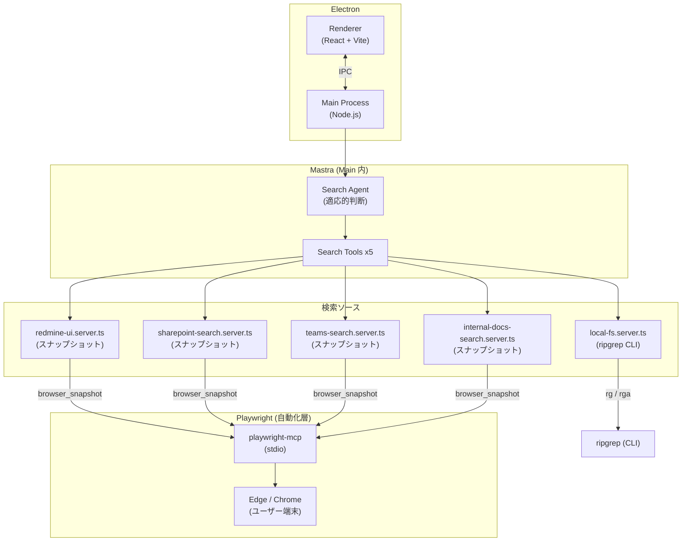
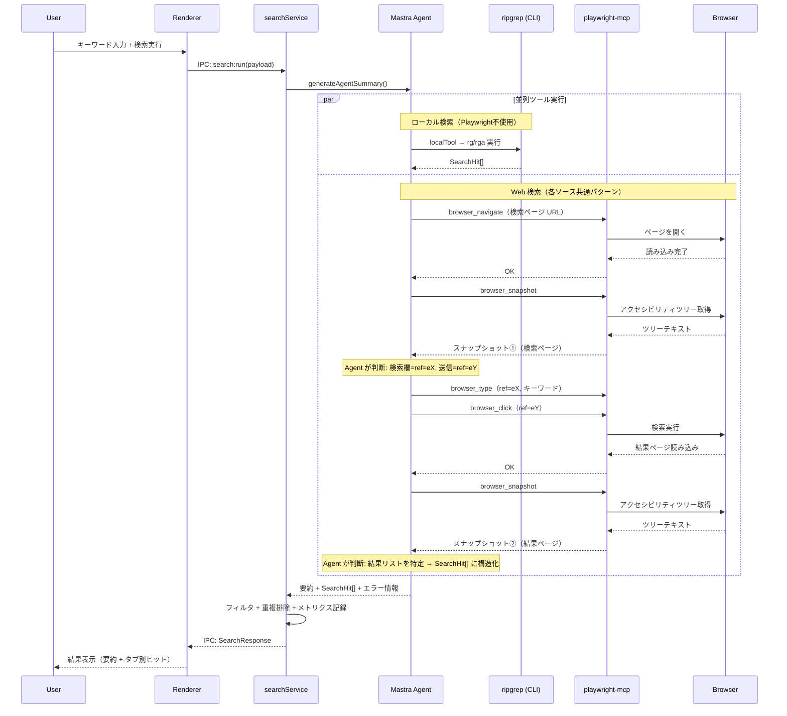
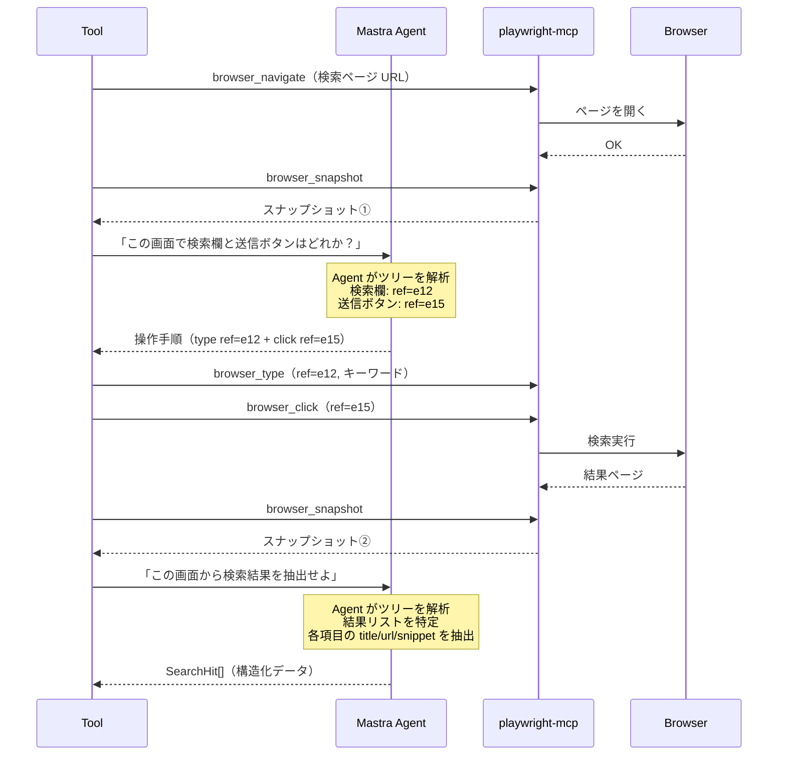

# SearchTool アーキテクチャ設計書

> **Version**: 2.0.0-draft
> **Parent**: cmd_020 / subtask_045

---

## 1. アーキテクチャ概要

### 設計思想

SearchTool は「**壊れない検索ツール**」を目指す。
固定 CSS セレクタや XPath に一切依存しない。
毎回アクセシビリティスナップショットから Mastra Agent が動的に要素を発見・操作する。
サイトの HTML 構造が変わっても、コード修正なしで動き続ける。

```
毎回: ページを開く → スナップショット → Agent が判断・操作 → 結果抽出
```

### 全体構成図



### 検索ソース一覧

| ソース | 検索対象 | 自動化方式 | MCP サーバー |
|--------|----------|-----------|-------------|
| ローカル | ファイル全文 | ripgrep CLI (rg/rga) | `local-fs.server.ts` |
| Redmine | チケット（タイトル・本文） | スナップショット + Agent 判断 | `redmine-ui.server.ts` |
| SharePoint | ドキュメント・ページ | スナップショット + Agent 判断 | `sharepoint-search.server.ts` |
| Teams | メッセージ（チャット・チャンネル本文） | スナップショット + Agent 判断 | `teams-search.server.ts` |
| 社内 Docs | Wiki・ブログ等 | スナップショット + Agent 判断 | `internal-docs-search.server.ts` |

### レイヤー構成

| レイヤー | 責務 | 技術 |
|----------|------|------|
| UI | 検索入力・結果表示・設定管理 | React 18 + Vite |
| オーケストレーション | 検索実行・結果集約・メトリクス | Electron Main + searchService |
| AI 判断 | ツール選択・要約・適応的要素発見・操作手順生成・結果構造化 | Mastra Agent + LLM |
| 自動化 | スナップショット取得・アクセシビリティベース Locator 操作 | playwright-mcp + Edge/Chrome |
| ローカル検索 | ファイル全文検索 | ripgrep (rg/rga) |

---

## 2. フォルダ構成

### 現行構成

```
searchtool/app/src/
├── main/
│   ├── main.ts                     # Electron エントリ
│   ├── preload.ts                  # IPC ブリッジ
│   ├── mastra/
│   │   ├── agent.ts                # Search Agent 定義
│   │   └── tools/
│   │       ├── localTool.ts        # ローカル検索ツール
│   │       ├── redmineTool.ts      # Redmine 検索ツール
│   │       ├── sharepointTool.ts   # SharePoint 検索ツール
│   │       ├── teamsTool.ts        # Teams 検索ツール
│   │       ├── internalDocsTool.ts # 社内 Docs 検索ツール
│   │       └── mcpClient.ts        # MCP ディスパッチャ
│   ├── mcp-servers/
│   │   ├── snapshot-extractor.ts    # [NEW] スナップショット → 構造化データ抽出
│   │   ├── local-fs.server.ts      # ripgrep ラッパー
│   │   ├── redmine-ui.server.ts    # Redmine 検索（スナップショット方式）
│   │   ├── sharepoint-search.server.ts
│   │   ├── teams-search.server.ts
│   │   └── internal-docs-search.server.ts
│   ├── services/
│   │   ├── searchService.ts        # 検索オーケストレーション
│   │   ├── metricsService.ts       # メトリクス収集
│   │   └── logger.ts               # JSONL ログ
│   └── settings/
│       └── store.ts                # 設定永続化 (Zod)
├── renderer/
│   ├── App.tsx                     # React ルート
│   ├── components/
│   │   ├── SearchPane.tsx          # 検索 UI
│   │   ├── Settings.tsx            # 設定画面
│   │   └── Metrics.tsx             # メトリクスダッシュボード
│   └── index.tsx                   # React エントリ
└── shared/
    ├── contracts.ts                # 検索 I/F 型定義
    └── settings.ts                 # 設定スキーマ (Zod)
```

### v1 からの差分

| 変更 | ファイル | 内容 |
|------|----------|------|
| **新規** | `mcp-servers/snapshot-extractor.ts` | スナップショットからの構造化データ抽出（共通ロジック） |
| **変更** | 各 `*.server.ts` | 固定セレクタ廃止 → スナップショット + Agent 判断方式に全面移行 |
| **変更** | `mastra/agent.ts` | 適応的判断ロジック追加（要素発見・操作手順生成） |
| **変更** | `shared/settings.ts` | ブラウザ設定スキーマの拡張 |

v1 のフォルダ構成を維持する。新規ファイルは `snapshot-extractor.ts` のみ。
不要な構造変更はしない。

---

## 3. コンポーネント責務一覧

### Renderer（検索 UI）

| コンポーネント | 責務 |
|----------------|------|
| `SearchPane.tsx` | キーワード入力、検索ソース選択（ピル）、件数上限、結果タブ表示 |
| `Settings.tsx` | API キー、ローカルルート、Web URL、ブラウザ設定、保存 |
| `Metrics.tsx` | 検索回数、平均時間、ソース別ヒット数、履歴テーブル |

Renderer は IPC 経由でのみ Main と通信する。ビジネスロジックを持たない。

### Main（検索実行・自動化・結果整形・ストレージ）

| モジュール | 責務 |
|------------|------|
| `main.ts` | Electron アプリ起動、BrowserWindow 作成、IPC ハンドラ登録 |
| `preload.ts` | `contextBridge` で Renderer に型付き API を公開 |
| `searchService.ts` | Agent 呼び出し → 結果フィルタ → 重複排除 → メトリクス記録 |
| `metricsService.ts` | インメモリ集計（最新 100 件） |
| `logger.ts` | JSONL ファイル出力（日次ローテーション） |
| `store.ts` | 設定 JSON の読み書き（Zod バリデーション付き） |

### Mastra（Main 内：Search Agent + Tools）

| モジュール | 責務 |
|------------|------|
| `agent.ts` | Mastra Agent 初期化、プロンプト構築、構造化出力（Zod）、適応的判断（スナップショットから要素発見・操作手順生成）、フォールバック |
| `localTool.ts` | ローカルファイル検索。ripgrep (rg/rga) を実行し SearchHit[] を返す |
| `redmineTool.ts` | Redmine チケット検索。スナップショットから Agent が検索欄・結果を動的に特定 |
| `sharepointTool.ts` | SharePoint ドキュメント検索。スナップショットから Agent が結果を動的に特定 |
| `teamsTool.ts` | Teams メッセージ検索。スナップショットから Agent がチャット・チャンネル本文を動的に特定・抽出 |
| `internalDocsTool.ts` | 社内 Docs 検索。スナップショットから Agent が検索 UI・結果を動的に特定 |
| `mcpClient.ts` | ツール名 → 対応する MCP サーバー実装にルーティング |
| `snapshot-extractor.ts` | スナップショットテキスト → LLM で SearchHit[] に構造化（全ソース共通） |

Agent の動作モード:

```
1. Agent モード（API キーあり）
   Agent がツールを選択・実行 → 要約 + 構造化結果を返す

2. フォールバックモード（API キーなし or Agent 失敗）
   全ツールを直接並列実行 → 要約なし、ヒットのみ返す
```

### ローカル検索層

| モジュール | 責務 |
|------------|------|
| `local-fs.server.ts` | ripgrep (rg/rga) を子プロセスで起動し、ファイル全文検索を実行。Playwright は使わない |

### Playwright（自動化層）

| モジュール | 責務 |
|------------|------|
| `redmine-ui.server.ts` | Redmine を開き、スナップショット取得 → Agent が検索欄・結果を判断 → Locator 操作 |
| `sharepoint-search.server.ts` | SharePoint を開き、スナップショット取得 → Agent が結果を判断 → 構造化 |
| `teams-search.server.ts` | Teams を開き、スナップショット取得 → Agent がメッセージ本文を判断 → 抽出 |
| `internal-docs-search.server.ts` | 汎用サイトを開き、スナップショット取得 → Agent が検索 UI・結果を判断 |
| playwright-mcp | stdio で起動。`browser_navigate`, `browser_snapshot`, `browser_click`, `browser_type` 等を提供 |
| Edge / Chrome | ユーザー端末のブラウザを使用（ログイン状態を活用） |

各 MCP サーバーの操作フロー（固定セレクタは使わない）:

```
1. browser_navigate: 検索ページを開く
2. browser_snapshot: アクセシビリティツリーを取得
3. Agent が判断: 「検索欄は ref=e5」「送信ボタンは ref=e8」
4. browser_type / browser_click: Agent が決めた要素を操作
5. browser_snapshot: 結果ページのツリーを取得
6. Agent が判断: ツリーから検索結果を抽出・SearchHit[] に構造化
```

ブラウザ選択の優先順位:

```
1. msedge（企業環境で最も普及）
2. chrome（個人環境向け）
3. chromium（フォールバック: 自動ダウンロード）
```

---

## 4. データフロー

### 検索リクエスト → 結果表示（全体フロー）



### Web 検索の適応的判断フロー（1ソースの詳細）



抽出プロンプトの詳細は [`repair_prompts.md`](./repair_prompts.md) を参照。

---

## 5. 適応的判断メカニズム

### なぜ固定セレクタを使わないか

Web サイトの HTML は予告なく変わる。
固定 CSS セレクタや XPath に依存すると、サイト更新のたびにコード修正が必要になる。

固定セレクタは **一切使わない**。
毎回アクセシビリティスナップショットを取得し、Mastra Agent が動的に要素を発見する。
DOM が変わってもコード修正なしで動き続ける。

### 基本戦略

```
┌───────────────────────┐
│ 1. ページを開く        │
└──────────┬────────────┘
           ▼
┌───────────────────────┐
│ 2. browser_snapshot   │ ← アクセシビリティツリー取得
│    （構造化テキスト）  │
└──────────┬────────────┘
           ▼
┌───────────────────────┐
│ 3. Agent が判断       │ ← 「検索欄はどれか？」「送信ボタンはどれか？」
│    → 操作手順を生成   │    スナップショット内の ref で特定
└──────────┬────────────┘
           ▼
┌───────────────────────┐
│ 4. 操作実行           │ ← browser_type, browser_click 等
│    → 結果ページ待ち   │
└──────────┬────────────┘
           ▼
┌───────────────────────┐
│ 5. browser_snapshot   │ ← 結果ページのツリー取得
└──────────┬────────────┘
           ▼
┌───────────────────────┐
│ 6. Agent が判断       │ ← 結果リストを特定
│    → SearchHit[] 構造化│    title, url, snippet を抽出
└───────────────────────┘
```

### 観察データ

Agent に渡すのはスクリーンショット（画像）ではなく、playwright-mcp の **アクセシビリティスナップショット**。

利点:
- テキストベースなのでトークン効率が良い
- DOM 構造を反映するので正確
- 視覚情報に依存しないのでヘッドレスでも動作
- 要素の `ref` 属性でそのまま操作対象を指定できる

### Agent の判断ポイント

| 判断 | 入力 | 出力 |
|------|------|------|
| 検索欄の特定 | スナップショット① | `ref` + 入力方法 |
| 送信方法の特定 | スナップショット① | `ref`（ボタン）or Enter キー |
| 結果リストの特定 | スナップショット② | 結果の構造（title/url/snippet の位置） |
| 結果の構造化 | スナップショット② | SearchHit[] |

### 制約

| 項目 | 値 | 理由 |
|------|-----|------|
| スナップショット取得 | 検索前 1 回 + 結果後 1 回 | 最小限の取得回数 |
| Agent 判断 | 操作前 1 回 + 抽出 1 回 | LLM コストを抑える |
| リトライ | 操作失敗時 1 回まで | これ以上はサイト障害とみなす |

プロンプト設計の詳細は [`repair_prompts.md`](./repair_prompts.md) を参照。

---

## 6. 技術スタック

### コア技術

| 技術 | バージョン | 用途 |
|------|-----------|------|
| Electron | 30.x | デスクトップアプリ基盤 |
| React | 18.x | UI フレームワーク |
| Vite | 5.x | フロントエンドビルド |
| TypeScript | 5.x | 型安全性 |
| Mastra | 0.23+ (v1) | AI Agent + Tool フレームワーク |
| Playwright | 1.56+ | ブラウザ自動化 |
| playwright-mcp | 0.0.12+ | Playwright の MCP サーバー化 |
| Zod | 3.x | スキーマバリデーション |
| ripgrep | 最新 | ローカルファイル検索 |
| Node.js | 22.13+ | ランタイム |

### ブラウザ戦略

```
優先: ユーザー端末の Edge / Chrome を使う（同梱しない）
理由:
  1. インストーラサイズの削減（Chromium 同梱で +281MB）
  2. ユーザーのログイン状態を活用できる
  3. 企業環境では Edge がほぼ確実に存在する

フォールバック:
  Edge も Chrome も見つからない場合のみ Chromium を自動ダウンロード
  （npx playwright install chromium）
```

Playwright のチャネル設定:

```typescript
// playwright-mcp 起動時
const args = ['--browser', 'msedge']  // Edge 優先
// Edge がなければ
const args = ['--browser', 'chrome']  // Chrome
// どちらもなければ
const args = ['--browser', 'chromium'] // フォールバック
```

### 配布形態

| 形態 | 対象 | ツール |
|------|------|--------|
| ポータブル (.exe) | Windows | electron-builder (NSIS portable) |
| AppImage | Linux | electron-builder |
| DMG | macOS | electron-builder |

ポータブル配布の詳細は `portable_data_layout.md`（別途作成）に定義予定。

---

## 7. 関連ドキュメント

| ドキュメント | 内容 | 状態 |
|-------------|------|------|
| **architecture.md** | 本書。アーキテクチャ全体像 | draft |
| [`repair_prompts.md`](./repair_prompts.md) | スナップショット抽出プロンプト設計 | 作成済み |
| `tool_interfaces.md` | Mastra Tool の I/F 定義 | 未作成 |
| `portable_data_layout.md` | ポータブル配布時のデータ配置 | 未作成 |
| `implementation_plan.md` | 実装計画 | 未作成 |
