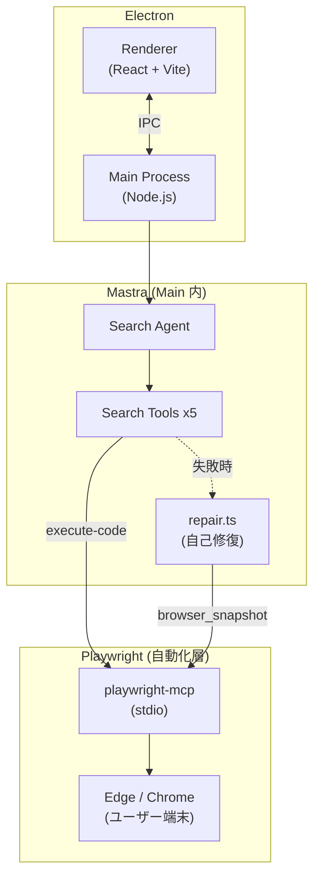
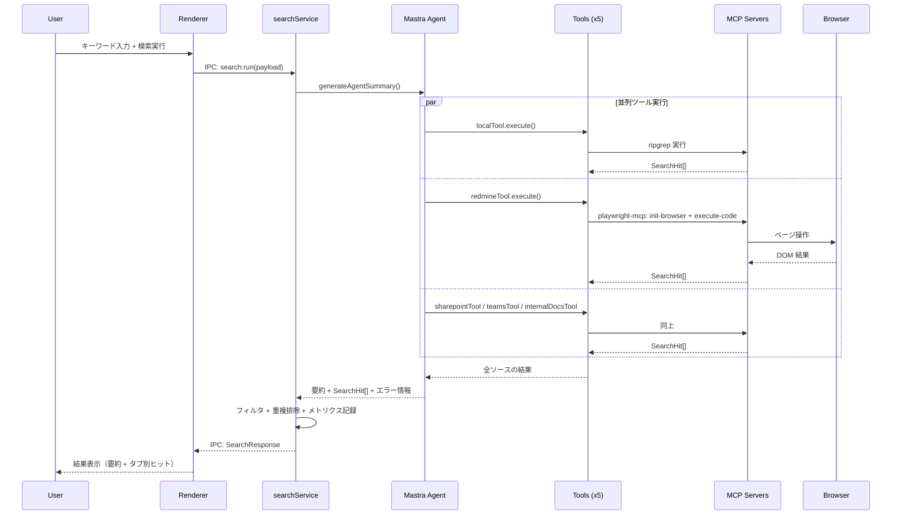
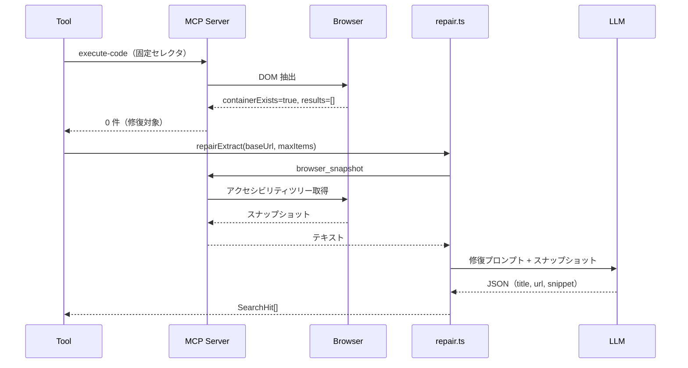

# SearchTool v2 アーキテクチャ設計書

> **Version**: 2.0.0-draft
> **Parent**: cmd_020 / subtask_045

---

## 1. アーキテクチャ概要

### 設計思想

SearchTool v2 は「**壊れにくい検索ツール**」を目指す。
通常は決定的なツール（固定セレクタ）で高速に動作し、
壊れたら Mastra Agent が playwright-mcp 経由で自己修復する。

```
通常: 固定セレクタ → 結果（高速・低コスト）
修復: スナップショット → LLM 再抽出（低速・高コスト、だが止まらない）
```

### 全体構成図



### レイヤー構成

| レイヤー | 責務 | 技術 |
|----------|------|------|
| UI | 検索入力・結果表示・設定管理 | React 18 + Vite |
| オーケストレーション | 検索実行・結果集約・メトリクス | Electron Main + searchService |
| AI 判断 | ツール選択・要約・自己修復 | Mastra Agent + LLM |
| 自動化 | Web ページ操作・結果抽出 | playwright-mcp + Edge/Chrome |
| ローカル検索 | ファイル全文検索 | ripgrep (rg/rga) |

---

## 2. フォルダ構成

### v2 理想形

```
searchtool/app/src/
├── main/
│   ├── main.ts                     # Electron エントリ
│   ├── preload.ts                  # IPC ブリッジ
│   ├── mastra/
│   │   ├── agent.ts                # Search Agent 定義
│   │   └── tools/
│   │       ├── localTool.ts        # ローカル検索ツール
│   │       ├── redmineTool.ts      # Redmine 検索ツール
│   │       ├── sharepointTool.ts   # SharePoint 検索ツール
│   │       ├── teamsTool.ts        # Teams 検索ツール
│   │       ├── internalDocsTool.ts # 社内 Docs 検索ツール
│   │       └── mcpClient.ts        # MCP ディスパッチャ
│   ├── mcp-servers/
│   │   ├── repair.ts               # [NEW] 共通自己修復ロジック
│   │   ├── local-fs.server.ts      # ripgrep ラッパー
│   │   ├── redmine-ui.server.ts    # Redmine スクレイピング
│   │   ├── sharepoint-search.server.ts
│   │   ├── teams-search.server.ts
│   │   └── internal-docs-search.server.ts
│   ├── services/
│   │   ├── searchService.ts        # 検索オーケストレーション
│   │   ├── metricsService.ts       # メトリクス収集
│   │   └── logger.ts               # JSONL ログ
│   └── settings/
│       └── store.ts                # 設定永続化 (Zod)
├── renderer/
│   ├── App.tsx                     # React ルート
│   ├── components/
│   │   ├── SearchPane.tsx          # 検索 UI
│   │   ├── Settings.tsx            # 設定画面
│   │   └── Metrics.tsx             # メトリクスダッシュボード
│   └── index.tsx                   # React エントリ
└── shared/
    ├── contracts.ts                # 検索 I/F 型定義
    └── settings.ts                 # 設定スキーマ (Zod)
```

### v1 からの差分

| 変更 | ファイル | 内容 |
|------|----------|------|
| **新規** | `mcp-servers/repair.ts` | 自己修復の共通ロジック（`repair_prompts.md` 参照） |
| **変更** | 各 `*.server.ts` | 修復判定 + `repair.ts` 呼び出しの追加 |
| **変更** | `mastra/agent.ts` | ブラウザチャネル設定の追加 |
| **変更** | `shared/settings.ts` | ブラウザ設定スキーマの拡張 |

v2 は v1 のフォルダ構成を維持する。新規ファイルは `repair.ts` のみ。
不要な構造変更はしない。

---

## 3. コンポーネント責務一覧

### Renderer（検索 UI）

| コンポーネント | 責務 |
|----------------|------|
| `SearchPane.tsx` | キーワード入力、検索ソース選択（ピル）、件数上限、結果タブ表示 |
| `Settings.tsx` | API キー、ローカルルート、Web URL、ブラウザ設定、保存 |
| `Metrics.tsx` | 検索回数、平均時間、ソース別ヒット数、履歴テーブル |

Renderer は IPC 経由でのみ Main と通信する。ビジネスロジックを持たない。

### Main（検索実行・自動化・結果整形・ストレージ）

| モジュール | 責務 |
|------------|------|
| `main.ts` | Electron アプリ起動、BrowserWindow 作成、IPC ハンドラ登録 |
| `preload.ts` | `contextBridge` で Renderer に型付き API を公開 |
| `searchService.ts` | Agent 呼び出し → 結果フィルタ → 重複排除 → メトリクス記録 |
| `metricsService.ts` | インメモリ集計（最新 100 件） |
| `logger.ts` | JSONL ファイル出力（日次ローテーション） |
| `store.ts` | 設定 JSON の読み書き（Zod バリデーション付き） |

### Mastra（Main 内：Search Agent + Tools）

| モジュール | 責務 |
|------------|------|
| `agent.ts` | Mastra Agent 初期化、プロンプト構築、構造化出力（Zod）、フォールバック |
| `*Tool.ts` | `createTool()` で定義。入出力スキーマ付き。MCP ディスパッチャに委譲 |
| `mcpClient.ts` | ツール名 → 対応する MCP サーバー実装にルーティング |
| `repair.ts` | スナップショット → LLM で検索結果を再抽出（詳細は `repair_prompts.md`） |

Agent の動作モード:

```
1. Agent モード（API キーあり）
   Agent がツールを選択・実行 → 要約 + 構造化結果を返す

2. フォールバックモード（API キーなし or Agent 失敗）
   全ツールを直接並列実行 → 要約なし、ヒットのみ返す
```

### Playwright（自動化層）

| モジュール | 責務 |
|------------|------|
| `*.server.ts` | 各サイト固有の検索 URL 構築 + execute-code による DOM 抽出 |
| playwright-mcp | stdio で起動。`init-browser`, `execute-code`, `browser_snapshot` を提供 |
| Edge / Chrome | ユーザー端末のブラウザを使用（ログイン状態を活用） |

ブラウザ選択の優先順位:

```
1. msedge（企業環境で最も普及）
2. chrome（個人環境向け）
3. chromium（フォールバック: 自動ダウンロード）
```

---

## 4. データフロー

### 検索リクエスト → 結果表示



### 自己修復フロー



修復の詳細は [`repair_prompts.md`](./repair_prompts.md) を参照。

---

## 5. 自己修復メカニズム概要

### なぜ必要か

Web サイトの HTML は予告なく変わる。
固定セレクタに依存すると、サイト更新のたびにコード修正が必要になる。
v2 では「**通常は決定的ツール、壊れたら LLM に委譲**」で対処する。

### 基本戦略

```
            ┌─────────────┐
            │ 固定セレクタ │ ← 高速・低コスト・決定的
            │  で抽出     │
            └──────┬──────┘
                   │
            結果あり？
           ┌──┴──┐
          Yes     No（コンテナは存在する）
           │       │
        返却    ┌──▼──────────────┐
               │ browser_snapshot │ ← アクセシビリティツリー
               │ → LLM 再抽出    │    （ピクセルではなく構造化テキスト）
               └──────┬──────────┘
                      │
               結果あり？
              ┌──┴──┐
             Yes     No
              │       │
           返却    エラー返却 + ログ記録
```

### 観察データ

LLM に渡すのはスクリーンショット（画像）ではなく、playwright-mcp の **アクセシビリティスナップショット**。

利点:
- テキストベースなのでトークン効率が良い
- DOM 構造を反映するので正確
- 視覚情報に依存しないのでヘッドレスでも動作

### 制約

| 項目 | 値 | 理由 |
|------|-----|------|
| 通常抽出 | 1 回 | 固定セレクタは冪等 |
| 修復抽出 | 1 回 | LLM コストが高い |
| 合計 | 最大 2 回 | これ以上はサイト障害とみなす |

修復プロンプトの仕様は [`repair_prompts.md`](./repair_prompts.md) に定義済み。

---

## 6. 技術スタック

### コア技術

| 技術 | バージョン | 用途 |
|------|-----------|------|
| Electron | 30.x | デスクトップアプリ基盤 |
| React | 18.x | UI フレームワーク |
| Vite | 5.x | フロントエンドビルド |
| TypeScript | 5.x | 型安全性 |
| Mastra | 0.23+ (v1) | AI Agent + Tool フレームワーク |
| Playwright | 1.56+ | ブラウザ自動化 |
| playwright-mcp | 0.0.12+ | Playwright の MCP サーバー化 |
| Zod | 3.x | スキーマバリデーション |
| ripgrep | 最新 | ローカルファイル検索 |
| Node.js | 22.13+ | ランタイム |

### ブラウザ戦略

```
優先: ユーザー端末の Edge / Chrome を使う（同梱しない）
理由:
  1. インストーラサイズの削減（Chromium 同梱で +281MB）
  2. ユーザーのログイン状態を活用できる
  3. 企業環境では Edge がほぼ確実に存在する

フォールバック:
  Edge も Chrome も見つからない場合のみ Chromium を自動ダウンロード
  （npx playwright install chromium）
```

Playwright のチャネル設定:

```typescript
// playwright-mcp 起動時
const args = ['--browser', 'msedge']  // Edge 優先
// Edge がなければ
const args = ['--browser', 'chrome']  // Chrome
// どちらもなければ
const args = ['--browser', 'chromium'] // フォールバック
```

### 配布形態

| 形態 | 対象 | ツール |
|------|------|--------|
| ポータブル (.exe) | Windows | electron-builder (NSIS portable) |
| AppImage | Linux | electron-builder |
| DMG | macOS | electron-builder |

ポータブル配布の詳細は `portable_data_layout.md`（別途作成）に定義予定。

---

## 7. 関連ドキュメント

| ドキュメント | 内容 | 状態 |
|-------------|------|------|
| **architecture_v2.md** | 本書。アーキテクチャ全体像 | draft |
| [`repair_prompts.md`](./repair_prompts.md) | 自己修復プロンプト設計 | 作成済み |
| `tool_interfaces.md` | Mastra Tool の I/F 定義 | 未作成 |
| `portable_data_layout.md` | ポータブル配布時のデータ配置 | 未作成 |
| `implementation_plan.md` | v2 実装計画 | 未作成 |
