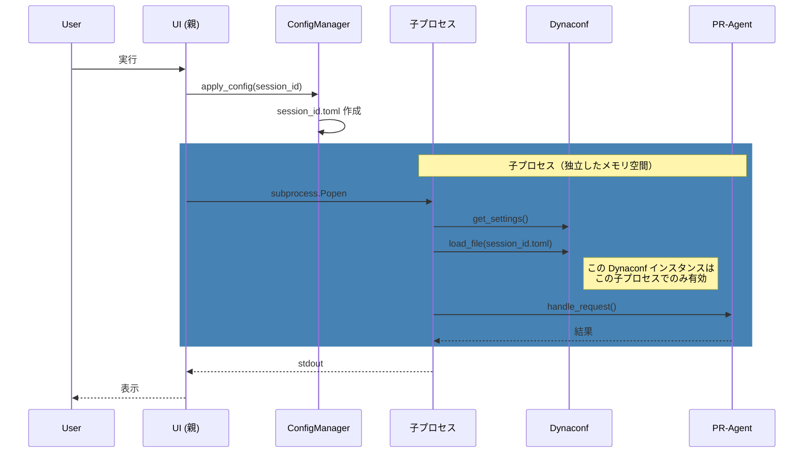
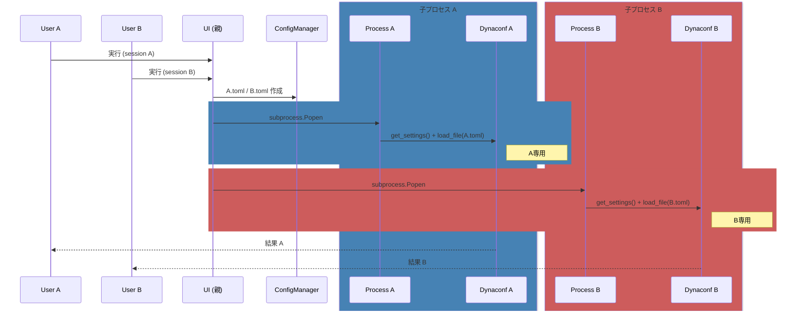

# PR-Agent Web Interface

PR-Agent OSSを活用したMerge Request/Pull Requestレビュー支援Webアプリケーション。

## 概要

### 何ができるか

- **MRレビュー**: GitLabのMerge Requestを自動レビュー
- **コード改善提案**: AIによるコード品質向上の提案
- **PRサマリー生成**: 変更内容の要約を自動生成
- **質問応答**: コードに関する質問への回答

### 技術スタック

- **フロントエンド**: Streamlit
- **バックエンド**: PR-Agent OSS (CodiumAI製)
- **設定管理**: Dynaconf
- **AI**: OpenAI / Google Gemini

---

## アーキテクチャ

### プロセス構成

```
[親プロセス: Streamlit UI]
    ↓ subprocess.Popen
[子プロセス: Python -c child_code]
    ↓ import & 呼び出し
[PR-Agent Core (同一子プロセス内)]
```

※ PR-Agent Coreは別プロセスではなく、子プロセス内でimportされて実行される

### シーケンス図（基本フロー）



詳細は [docs/pr_agent_sequence.md](docs/pr_agent_sequence.md) を参照。

---

## 用語集

| 用語 | 説明 |
|------|------|
| **Dynaconf** | Python用の設定管理ライブラリ。toml/yaml等から設定を読み込む。PR-Agent OSSが使用。 |
| **session_id** | Streamlitセッションごとの一意ID。設定ファイル分離に使用。 |
| **ConfigManager** | 設定ファイルのマージ・書き出しを担当するクラス。 |
| **PR-Agent OSS** | CodiumAI製のオープンソースPRレビューツール。 |
| **settings.load_file()** | Dynaconfのメソッド。追加の設定ファイルを読み込み、後勝ちでマージする。 |
| **subprocess.Popen** | Pythonの子プロセス起動API。独立したメモリ空間を生成。 |

---

## 複数ユーザー同時実行

### なぜ安全か

複数ユーザーが同時に実行しても、以下の仕組みで完全に分離される：

| 要素 | 分離単位 | 説明 |
|------|----------|------|
| **subprocess.Popen** | プロセス | 独立したメモリ空間を生成 |
| **Dynaconf** | プロセス | 各子プロセスで新規インスタンス |
| **load_file()** | プロセス | 子プロセス内のDynaconfにのみ適用 |
| **session_id.toml** | ファイル | ユーザーごとに別ファイル |

### シーケンス図（複数ユーザー同時実行）



> **結論**: Dynaconf は子プロセス単位で完全に分離。他ユーザーと混線しない。

---

## 設定ファイル

### ファイル構成

```
config/
├── common.toml              # 共通設定（全ユーザー共通）
└── custom/
    ├── aggressive.toml      # アグレッシブ設定
    ├── conservative.toml    # 保守的設定
    └── ...                  # カスタム設定

.pr_agent_sessions/
├── <session_id_A>.toml      # ユーザーA 専用（実行時生成）
├── <session_id_B>.toml      # ユーザーB 専用（実行時生成）
└── ...
```

### 各ファイルの役割

| ファイル | 役割 |
|----------|------|
| `common.toml` | 全ユーザー共通の基本設定。APIエンドポイント、デフォルトモデル等。 |
| `custom/*.toml` | UI で選択可能なプリセット設定。レビュースタイルを切り替え可能。 |
| `.pr_agent_sessions/<session_id>.toml` | 実行時に生成されるセッション専用設定。common + custom をマージした結果。 |

### 設定読み込みの流れ

**親プロセス（ConfigManager）:**
1. `common.toml` + ユーザー選択設定をマージ
2. `.pr_agent_sessions/<session_id>.toml` に書き出し
3. `config_file` パスを子プロセスに渡す

**子プロセス（PRAgentRunner）:**
1. `get_settings()` → OSS の Dynaconf（初期設定済み）を取得
2. `load_file(session_id.toml)` → セッション用設定を後勝ちマージ
3. PR-Agent Core が `settings` を参照して動作

---

## 関連ドキュメント

- [プロセス分離とセッション管理の詳細](docs/pr_agent_sequence.md)
