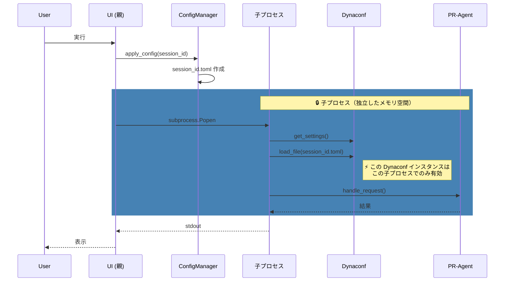
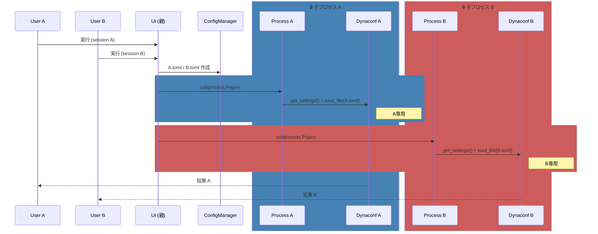

# PR-Agent プロセス分離とセッション管理

## プロセス構成

```
[親プロセス: Streamlit UI]
    ↓ subprocess.Popen
[子プロセス: Python -c child_code]
    ↓ import & 呼び出し
[PR-Agent Core (同一子プロセス内)]
```

※ PR-Agent Coreは別プロセスではなく、子プロセス内でimportされて実行される

## 複数人同時実行時の分離ポイント

1. **session_id**: Streamlitセッションごとに一意
2. **設定ファイル**: `.pr_agent_sessions/<session_id>.toml` で分離
3. **子プロセス**: 各実行ごとに独立したプロセス
4. **環境変数**: child_env で親から分離
5. **ログ**: session_id でバッファを分離

→ **複数ユーザーが同時実行しても問題なし**

---

## シーケンス図（基本フロー）



## シーケンス図（複数ユーザー同時実行）



### 分離の仕組み（一目でわかる）

| 要素 | 分離単位 | 説明 |
|------|----------|------|
| **subprocess.Popen** | プロセス | 独立したメモリ空間を生成 |
| **Dynaconf** | プロセス | 各子プロセスで新規インスタンス |
| **load_file()** | プロセス | 子プロセス内のDynaconfにのみ適用 |
| **session_id.toml** | ファイル | ユーザーごとに別ファイル |

> **結論**: Dynaconf は子プロセス単位で完全に分離。他ユーザーと混線しない。

---

## 分離の詳細

### 1. session_id による分離

- Streamlit の `get_script_run_ctx().session_id` を使用
- 各ユーザーセッションで一意の ID が生成される
- この ID が全ての分離機構のキーとなる

### 2. 設定ファイル分離

```
.pr_agent_sessions/
├── <session_id_A>.toml  ← ユーザーA 専用
├── <session_id_B>.toml  ← ユーザーB 専用
└── <session_id_C>.toml  ← ユーザーC 専用
```

各ユーザーの設定（APIキー、トークン等）が完全に分離される。

#### 設定読み込みの流れ

**親プロセス（ConfigManager）:**
1. `common.toml` + ユーザー選択設定をマージ
2. `.pr_agent_sessions/<session_id>.toml` に書き出し
3. `config_file` パスを子プロセスに渡す

**子プロセス（PRAgentRunner）:**
1. `from pr_agent.config_loader import get_settings`
2. `settings = get_settings()` → OSS の Dynaconf（初期設定済み）を取得
3. `settings.load_file(config_path)` → セッション用tomlを追加読み込み（後勝ちマージ）
4. PR-Agent Core が `settings` を参照して動作

**ポイント:**
- `.pr_agent.toml` は直接使われない（ConfigManager がマージ元として読むのみ）
- `PR_AGENT_SETTINGS_PATH` 環境変数は不要（OSS側で使用されていない）
- `settings.load_file()` により後から読んだ設定が優先される

### 3. 子プロセス分離

- `subprocess.Popen` で独立したプロセスを起動
- 各プロセスは独自の環境変数、メモリ空間を持つ
- stdout/stderr も完全に独立

### 4. ログバッファ分離

```python
Logger._buffers = {
    "session_A": SessionLogBuffer("session_A"),
    "session_B": SessionLogBuffer("session_B"),
    ...
}
```

各セッションのログが混在しない。

### 5. 環境変数分離

子プロセス起動時に親プロセスの `os.environ` をコピーし、
子プロセス専用の環境変数として渡す。

```python
child_env = os.environ.copy()
# 親プロセスの os.environ は変更しない
```

---

## 安全性の確認

✅ **複数ユーザーが同時に実行しても問題なし**

- 各ユーザーは独自の session_id を持つ
- 設定ファイルはセッションごとに分離
- 子プロセスは完全に独立
- 環境変数も子プロセスごとにコピー
- ログバッファも session_id で分離
- stdout も各子プロセスで独立

→ **競合や混線は発生しない**
