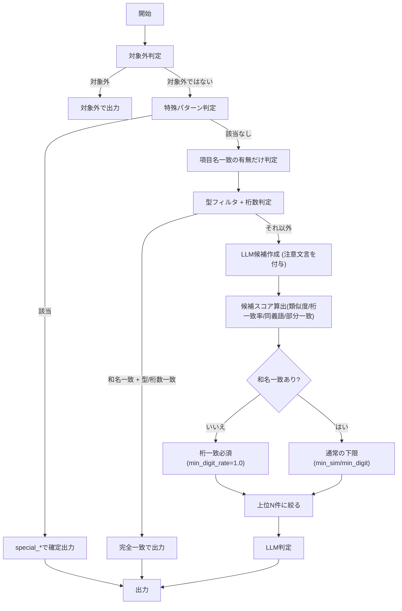

# マッチング対応表（画面項目定義 / テーブル定義 / ドメイン定義）

このファイルは、実装で使っている各種YAML設定ファイルの内容を踏まえて、
「どの列同士がどの判定に使われるか」をまとめたものです。

参照元:
- `/home/shota/src/salesforce/word/domain/domain_mapping.yaml` — ドメインデータ型の大分類マッピング
- `/home/shota/src/salesforce/word/domain/type_mapping.yaml` — 画面型/テーブル型/ドメイン型の大分類定義
- `/home/shota/src/salesforce/word/domain/text_type_mapping.yaml` — テキストタイプ→ドメインデータ型の対応
- `/home/shota/src/salesforce/word/domain/special_patterns.yaml` — 特殊パターン（フラグ/日付/コメント）のキーワード・条件
- `/home/shota/src/salesforce/word/domain/synonyms.yaml` — 同義語辞書
- `/home/shota/src/salesforce/word/domain/config_loader.py` — 上記YAMLの統一ローダー（キャッシュ付き）

---

※ 以前の「項目名の一致ルール」表は最新フローに合わせて削除済みです。現在は **10章の各ステップ** を正とします。

## 10. Cルール（C方式）フロー（ソース準拠）

参照: `/home/shota/src/salesforce/word/domain/domain_matcher.py`

### 10-1. 入力正規化
- `normalize_text()` / `normalize_data_type()` で文字/型を正規化
  - 同義語の統一（例: `価格` → `金額`, `cd` → `コード`）はYAML設定（synonyms.yaml）に基づく
  - 型の正規化（例: `varchar2` → `varchar`, `number` → `decimal`）もYAML設定（type_mapping.yaml）に基づく
- 項目名は `strip_digits()` で **末尾数字のみ** を除去した比較用文字列を作成
  - 例: `受注日付1` → `受注日付`、`1月売上` → `1月売上`（中間の数字は保持）
- 使用列:
  - 画面項目定義: `項目名称`, `型`, `テキストタイプ`, `最小桁`, `最大桁`, `最大バイト数`, `最小値`, `最大値`, `外部コード`
  - テーブル定義: `論理項目名`, `データ型`, `Length`, `全体数桁`, `小数桁`
  - ドメイン一覧: `ドメイン名`, `データ型`, `カラム定義`, `最小文字数`, `最大文字数`, `最小バイト数`, `最大バイト数`, `整数部桁数`, `小数部桁数`, `最小値`, `最大値`, `参照外部コードID`

### 10-2. 対象外判定
- 画面: `テキストタイプ/最小桁/最大桁/最大バイト数/最小値/最大値/外部コード` が全空 → `out_of_scope`
- テーブル: `データ型/Length/全体数桁/小数桁` が全空 → `out_of_scope`
- 使用列:
  - 画面項目定義: `テキストタイプ`, `最小桁`, `最大桁`, `最大バイト数`, `最小値`, `最大値`, `外部コード`
  - テーブル定義: `データ型`, `Length`, `全体数桁`, `小数桁`

### 10-3. 特殊パターン判定（確定）
- フラグ / コメント / 日付（汎用/個別）を先に確定
- `special_flag / special_comment / special_date / special_date_individual`
- パターン定義: `special_patterns.yaml` に外出し（キーワード・条件・出力ドメイン名を定義）
- 使用列:
  - 画面項目定義: `項目名称`, `型`, `テキストタイプ`, `最大桁`
  - テーブル定義: `論理項目名`, `データ型`, `Length`
  - ドメイン一覧: `データ型`, `書式（正規表現）`（参照）

### 10-4. 項目名一致（名前のみ）
- 末尾数字除去後の項目名で **一致有無だけを判定（型・桁数は見ない）**
- 一致したかどうかだけを記録し、**次のステップで型/桁数の判定**を行う
- このステップでは **同義語は使わない**（文字列の完全一致のみ）
- 文字列比較時は **コード/ID/番号** を除外して比較する
- ここで「和名一致フラグ」を保持し、**LLM候補の下限ルール**に影響する
- 使用列:
  - 画面項目定義: `項目名称`
  - テーブル定義: `論理項目名`
  - ドメイン一覧: `ドメイン名`

### 10-5. 型フィルタ + 桁数判定（確定/LLM分岐）

型比較は **入力ソースごとに異なる比較戦略** を取る。

#### 比較A: テーブル定義 vs ドメイン定義

ドメイン定義に「カラム定義」列がある場合、Oracle型同士で直接比較する（本命ルート）。
カラム定義列がない場合は、従来のデータ型比較にフォールバックする。

**カラム定義列ありの場合（Oracle型直接比較）:**

| テーブル定義の列 | ドメイン定義の列 | 比較内容 |
|---|---|---|
| データ型 | カラム定義 | Oracle型同士の一致（例: `NUMBER` vs `NUMBER`） |
| 桁数（数値全体桁数/整数） | カラム定義の桁 | 全体桁数の一致 |
| 整数桁 | 整数桁 | 整数部桁数の一致 |
| 小数桁 | 小数桁 | 小数部桁数の一致 |
| Length（文字列の場合） | 文字列長 | 文字列長の一致 |

- `CHAR(12 BYTE)` / `VARCHAR2(20 CHAR)` のような表記からも型名と桁数を抽出する
- 数値の正規化（例: `12.0` → `12`）で桁数比較の誤判定を防ぐ

**カラム定義列なしの場合（フォールバック）:**

| テーブル定義の列 | ドメイン定義の列 | 比較内容 |
|---|---|---|
| データ型 | データ型 | `normalize_data_type()` で正規化後に大分類比較 |
| Length | 最大文字数 or 最大バイト長 | 文字列系の桁数 |
| 全体数桁 | 整数部桁数 | 数値系の桁数 |
| 小数桁 | 小数部桁数 | 小数部の桁数 |

- 正規化: `normalize_data_type()` で型名を正規化
- 大分類: `type_mapping.yaml` による判定
- 互換ルール: コード系 ↔ 文字列系は互換、大分類が「不明」は除外しない

#### 比較B: 項目定義（画面） vs ドメイン定義

画面項目定義はOracle型を持たないため、日本語データ型同士で比較する。

| 項目定義の列 | ドメイン定義の列 | 比較内容 |
|---|---|---|
| テキストタイプ | データ型 | 日本語データ型の一致（例: `半角英数字` vs `半角英数字`） |
| 最大桁（文字列の場合） | 文字列～最大桁 | 文字列長の一致 |
| 最小値 / 最大値 | 最小値 / 最大値 | 数値範囲の照合 |
| 外部コード | 参照外部コード | 外部コードの照合 |

- `text_type_mapping.yaml` でテキストタイプからドメインデータ型候補を絞り込む
- 絞り込みで空になる場合はフォールバック（全候補から桁数で判定）

#### 判定結果（共通）

- **和名一致 + 型/桁数一致** → `exact`
- **和名一致だが型/桁数不一致** → `is_resolved=False`（LLMに渡す）+ 注意文言
  - 「注意: 同じ項目名で別桁/別データ型があります」を必ず付与
- 完全一致の名前比較でも **末尾数字除去 + コード/ID/番号除去** を適用する

### 10-6. テキストタイプ絞り込み（画面のみ）
- `text_type_mapping.yaml` に基づき候補を絞る
- 絞り込みで空になる場合はフォールバック（全候補から桁数で判定）
- 使用列:
  - 画面項目定義: `テキストタイプ`
  - ドメイン一覧: `データ型`

### 10-7. 同義語/部分一致の証拠収集（LLM材料）
- `synonyms.yaml` の同義語辞書によるヒット、部分一致スコア、類似度を計算
- **LLM判定へ渡す材料**として保持
- **和名一致がない場合**: 桁数一致候補は類似度に関係なくLLMへ渡す
- 使用列:
  - 画面項目定義: `項目名称`
  - テーブル定義: `論理項目名`
  - ドメイン一覧: `ドメイン名`
- 同名（末尾数字除去後）が一致するドメインは **必ずLLM候補に含める**

### 10-8. LLM候補の絞り込み
- 候補ごとのスコア:
  - 類似度(name_similarity)
  - 桁一致率(digit_match_rate)
  - 同義語ヒット
  - 部分一致スコア
- スコアの重み付け:
  - 桁一致率 0.6 / 類似度 0.4 / 同義語ヒットは加点
- 下限フィルタ:
  - **和名一致あり** → 通常の下限(min_sim/min_digit)
  - **和名一致なし** → 桁一致必須(min_digit_rate=1.0)
- 上位N件に絞って LLM へ渡す

### 10-9. LLMの判断基準（提案）
**前提**: LLMは **日本語の意味比較と桁一致率を同じ重要度** で評価し、文字列類似度は参考情報として扱う。
**データ型（大分類）一致は前提条件**として扱う。

判断の目安:
1. **候補提案（suggested）にする条件**
   - 意味が一致している **かつ**
   - 桁一致率が高い（目安: 0.80以上）
2. **新規提案（new_domain）にする条件**
   - 意味が一致していても桁一致率が低い
   - 桁一致率が高くても意味が一致しない

### 10-10. 出力（INDEX/MATCHキー含む）
- 画面項目_抽出/重複排除: `項目名称（末尾数字除去後） + 桁数（最大桁優先、なければ最大バイト数）`
- テーブル定義_抽出/重複排除: `論理項目名（末尾数字除去後） + 桁数（整数部.小数部優先、なければLength）`
- 抽出シートでは INDEX/MATCH 関数で重複排除シートの判定結果を参照する

### 10-11. 新規提案の汎化判定（LLM）
- 提案一覧を作成した後に **新規提案同士の汎化可否をまとめて判定**
- **LLM有効時のみ** 実行（無効時は汎化候補は空のまま）
- 出力シートの「汎化候補」に反映される

---

## Mermaid: 判定フローチャート（日本語）

